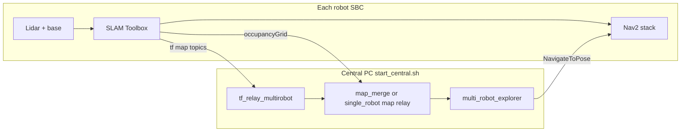

# Autonomous Navigation Systems: Central Computer - Autonomous Exploration Setup

This workspace contains editable TurtleBot3 packages for ROS 2 Humble, configured for autonomous exploration and mapping with Nav2, SLAM Toolbox, and a central multi-robot explorer.

## Table of Contents

1. [Prerequisites](#prerequisites)
   - [Installing Ubuntu 22.04 LTS Desktop](#installing-ubuntu-2204-lts-desktop)
   - [Installing ROS 2 Humble](#installing-ros-2-humble)
2. [Workspace Setup](#workspace-setup)
   - [Cloning the Repository](#cloning-the-repository)
   - [Building the Workspace](#building-the-workspace)
3. [Robot Configuration and ROS Domain](#robot-configuration-and-ros-domain)
4. [Multi-Robot SLAM](#multi-robot-slam)
   - [Robot Terminal 1: Robot Bringup](#robot-terminal-1-robot-bringup)
   - [Robot Terminal 2: SLAM + Nav2](#robot-terminal-2-slam--nav2)
   - [Central Terminals: start_central.sh + RViz](#central-terminals-start_centralsh--rviz)
5. [System architecture (how it works)](#system-architecture-how-it-works)
6. [Troubleshooting](#troubleshooting)
7. [Diagnostic Commands](#diagnostic-commands)
8. [Additional Resources](#additional-resources)
9. [Workspace Structure](#workspace-structure)
10. [Compatibility Matrix](#compatibility-matrix)
11. [Contributing and Validation Workflow](#contributing-and-validation-workflow)

---

## Prerequisites

### Installing Ubuntu 22.04 LTS Desktop

Before setting up the workspace, you need Ubuntu 22.04 LTS Desktop installed on your Remote PC.

**Download the Ubuntu 22.04 LTS Desktop image:**

- Visit: <https://releases.ubuntu.com/22.04/>
- Download the **64-bit PC (AMD64) desktop image** (`ubuntu-22.04.5-desktop-amd64.iso`)

**Installation instructions:**

- Follow the official Ubuntu installation guide: <https://ubuntu.com/tutorials/install-ubuntu-desktop#1-overview>
- The guide covers:
  - Creating a bootable USB stick
  - Booting from USB
  - Installation setup and configuration
  - Completing the installation

**System requirements:**

- At least 25GB of storage space
- A flash drive (12GB or above recommended) for the installation media
- At least 1024MiB of RAM

---

### Installing ROS 2 Humble

After installing Ubuntu 22.04 LTS, install ROS 2 Humble on your Remote PC.

**Follow the official ROS 2 installation guide:**

- <https://docs.ros.org/en/humble/Installation/Ubuntu-Install-Debs.html>

The installation process includes:

1. Setting up locale and sources
2. Installing ROS 2 packages
3. Setting up the environment
4. Installing additional tools (colcon, argcomplete, etc.)

**Central install checklist (required for `start_central.sh` + `start_rviz_central.sh`):**

```bash
# 1) Set locale
sudo apt update && sudo apt install locales
sudo locale-gen en_US en_US.UTF-8
sudo update-locale LC_ALL=en_US.UTF-8 LANG=en_US.UTF-8
export LANG=en_US.UTF-8

# 2) Add ROS 2 apt repository (keyring-based; Ubuntu 22.04)
sudo apt install software-properties-common
sudo add-apt-repository universe
sudo apt update && sudo apt install curl gnupg lsb-release -y
sudo curl -sSL https://raw.githubusercontent.com/ros/rosdistro/master/ros.key \
  -o /usr/share/keyrings/ros-archive-keyring.gpg
echo "deb [arch=$(dpkg --print-architecture) signed-by=/usr/share/keyrings/ros-archive-keyring.gpg] \
http://packages.ros.org/ros2/ubuntu $(. /etc/os-release && echo $UBUNTU_CODENAME) main" | \
  sudo tee /etc/apt/sources.list.d/ros2.list > /dev/null

# 3) Install ROS 2 Humble base
sudo apt update
sudo apt install ros-humble-desktop

# 4) Install central-required ROS packages
# - navigation2/nav2_msgs used by central exploration packages
# - slam-toolbox used by map/SLAM workflow
# - domain-bridge required by bridged_domains mode in start_central.sh
sudo apt install ros-humble-navigation2 ros-humble-slam-toolbox ros-humble-domain-bridge

# 5) Install central-required Python/system tools
# - yaml is required by central startup/config scripts
# - numpy is required by multi_robot_explorer.py
sudo apt install python3-colcon-common-extensions python3-argcomplete python3-yaml python3-numpy python3-rosdep

# 6) Source ROS and resolve workspace package dependencies
source /opt/ros/humble/setup.bash
sudo rosdep init 2>/dev/null || true
rosdep update
rosdep install --from-paths src --ignore-src -r -y

# 7) Build central workspace
bash scripts/build/rebuild_common.sh clean

# 8) Optional preflight checks
python3 -c "import yaml, numpy; print('python deps ok')"
ros2 pkg list | grep -E 'nav2_msgs|domain_bridge'
command -v rviz2
```

After this checklist completes, continue to the run section and start:

- `./scripts/core/start_central.sh`
- `./scripts/core/start_rviz_central.sh`

**Note:** This workspace uses system Navigation2 packages (installed via apt) for faster builds. The workspace contains:

- TurtleBot3 core packages
- Navigation2 configuration and launch files
- Central multi-robot exploration components
- Custom launch files and scripts

The Navigation2 source code is included in the repository for reference, but the build scripts use the system-installed packages instead.

---

## Workspace Setup

### Cloning the Repository

Clone the repository to your workspace directory:

```bash
cd ~
git clone https://github.com/SleepyFinale/turtlebot3-workspace.git central-computer
cd ~/central-computer
```

This repository contains all the necessary packages for TurtleBot3 autonomous exploration:

- TurtleBot3 core packages (DynamixelSDK, turtlebot3_msgs, turtlebot3)
- Navigation2 configuration
- Central multi-robot exploration components
- Custom launch files and scripts

You can now branch, push, and pull changes as needed for your development workflow.

---

### Building the Workspace

The workspace build entrypoint is:

#### `scripts/build/rebuild_common.sh <clean|minimal>`

It supports two modes:

- `clean`: complete clean rebuild of the workspace.
- `minimal`: rebuild only central-PC essentials (`multirobot_map_merge` and dependencies).

In both modes, it:

- Removes all build artifacts (`build/`, `install/`, `log/` directories)
- Checks for system dependencies
- Verifies Navigation2 packages are installed
- Builds with `colcon` and saves a build log under `log/`
- Sources the workspace automatically after build

**Usage:**

```bash
cd ~/central-computer
bash scripts/build/rebuild_common.sh clean
# or
bash scripts/build/rebuild_common.sh minimal
```

**When to use:**

- First-time setup
- `clean` after major changes across multiple packages
- When experiencing build issues that require a clean slate
- After pulling significant changes from the repository
- `minimal` for faster central-only iteration when you mostly need:
  - `./scripts/core/start_central.sh`
  - `./scripts/core/start_rviz_central.sh`

**Note:** Both scripts automatically source the workspace after building. All helper scripts (robot setup, build, SLAM, explorer) are located in the `scripts/` folder. To set the robot environment before connecting: `source scripts/env/set_robot_env.sh <robot>`. On `TAMU_WiFi` (DHCP), use `source scripts/env/set_robot_env.sh <robot> <current_ip>` for the original four robots. If you need to manually source the workspace:

```bash
cd ~/central-computer
source scripts/env/ros_robot_env.bash
```

---

## Script Organization

The `scripts/` folder is organized by purpose:

- `scripts/core/`: central runtime entry points (`start_central.sh`, `start_rviz_central.sh`)
- `scripts/build/`: workspace rebuild helpers
- `scripts/env/`: ROS/robot shell environment setup
- `scripts/bridging/`: domain bridge/action relay helpers
- `scripts/diagnostics/`: TF/map/debug tools and bag capture
- `scripts/validation/`: KPI and log validation utilities
- `scripts/plotting/`: plotting helpers

## 10-Minute Operator Quickstart

Use this when you need a clean fleet bring-up without reading the full runbook first.

- **[CENTRAL-PC] Build and source**

  ```bash
  cd ~/central-computer
  bash scripts/build/rebuild_common.sh minimal
  source scripts/env/ros_domain_profile.bash
  source scripts/env/ros_robot_env.bash
  ```

- **[ROBOT-SBC] On each robot terminal 1**

  ```bash
  source scripts/env/ros_robot_env.bash
  export TURTLEBOT3_MODEL=burger
  ros2 launch turtlebot3_bringup robot.launch.py
  ```

- **[ROBOT-SBC] On each robot terminal 2**

  ```bash
  source scripts/env/ros_robot_env.bash
  export TURTLEBOT3_MODEL=burger
  ros2 launch turtlebot3_navigation2 navigation2_slam.launch.py \
    use_sim_time:=false use_rviz:=false fleet_mode:=true nav2_use_local_slam_map:=true
  ```

- **[CENTRAL-PC] Start central stack, then RViz**

  ```bash
  ./scripts/core/start_central.sh
  ./scripts/core/start_rviz_central.sh
  ```

- **[CENTRAL-PC] Confirm merged map and robot actions**

  ```bash
  ros2 topic echo /map --once
  ros2 action list | rg navigate_to_pose
  ```

## Robot Configuration and ROS Domain

To connect this central computer to the TurtleBot3 robots you need:

- The **correct SSH target (IP/hostname)** for each robot
- The **same WiFi network** between robot and central PC
- A ROS domain policy:
  - `bridged_domains` (**required for this fleet**): per-robot domains bridged into a central domain
  - `shared_domain` (legacy): one domain ID on all machines — **do not use for multi-robot SLAM/exploration here** (known poor behavior vs bridges; not a valid regression baseline)

### Robot SSH targets

The table below lists the SSH targets for each robot on the supported WiFi networks.

| Robot  | SNS (lab)             | GCRI_LAB (gcri)       | RaspAP (rpi)        |
| ------ | --------------------- | --------------------- | ------------------- |
| Blinky | blinky@192.168.0.158  | blinky@192.168.50.158 | blinky@10.3.141.158 |
| Pinky  | pinky@192.168.0.194   | pinky@192.168.50.194  | pinky@10.3.141.194  |
| Inky   | inky@192.168.0.139    | inky@192.168.50.139   | inky@10.3.141.139   |
| Clyde  | clyde@192.168.0.236   | clyde@192.168.50.236  | clyde@10.3.141.236  |

`TAMU_WiFi` is also supported on the robot side, but it uses DHCP (no fixed per-robot IP table). On TAMU, discover the current robot IP and pass it explicitly to `set_robot_env.sh`.

### Using `set_robot_env.sh` to SSH into a robot

`scripts/env/set_robot_env.sh` sets `ROBOT_SSH` for the selected robot. For **Blinky**, **Pinky**, **Inky**, and **Clyde**, it auto-detects your PC WiFi:

- `SNS` -> `lab` (fixed fleet IPs)
- `GCRI_LAB` -> `gcri` (fixed fleet IPs)
- `RaspAP` -> `rpi` (fixed fleet IPs)
- `TAMU_WiFi` -> `tamu` (**manual IP required** for original robots, because TAMU is DHCP)

For robots outside the original four, provide a second-argument IP override on any network.

From the workspace root on the **central PC**, source the script so variables apply to your current shell:

```bash
cd ~/central-computer

# Any original fleet robot: fixed IPs on SNS/GCRI_LAB/RaspAP
source scripts/env/set_robot_env.sh blinky
# or
source scripts/env/set_robot_env.sh pinky
# or
source scripts/env/set_robot_env.sh inky
# or
source scripts/env/set_robot_env.sh clyde

# TAMU_WiFi (DHCP): pass current robot IP explicitly
# source scripts/env/set_robot_env.sh blinky 10.42.0.123

# Optional for non-original robots: force SSH target, e.g.
# source scripts/env/set_robot_env.sh donatello 192.168.0.250
```

Then SSH into the robot:

```bash
ssh $ROBOT_SSH
```

**Script output:** The script prints the detected network (`lab`, `gcri`, `rpi`, or `tamu`) so you can confirm it picked the right one. Example: `Robot: Blinky  ROBOT_SSH=blinky@192.168.50.158  (network: gcri)`.

When switching between robots, run `source scripts/env/set_robot_env.sh <robot>` again in each terminal (or open new terminals and source once).

### Robot-side WiFi automation caveats

Robot WiFi switching/boot logic lives in the robot repository (`~/turtlebot3`) under:

- `scripts/network/switch_wifi.sh`
- `scripts/network/boot_wifi.sh`
- `scripts/network/install_boot_wifi.sh`

Important caveats when coordinating from central:

- Boot auto-connect service (`boot-wifi.service`) tries `lab -> gcri -> rpi` by default; it does not auto-prioritize TAMU.
- Ensure only one netplan file configures `wlan0` on the robot. If `99-wifi-switch.yaml` is used, remove/comment `wifis.wlan0` in `/etc/netplan/50-cloud-init.yaml` to avoid duplicate access-point errors.

### ROS domain (ROS_DOMAIN_ID)

This stack supports two comms modes, but **fleet runs must use bridges**.

1) `bridged_domains` (**use this**)
   - Central uses `fleet_domain_map.central_domain_id` (default `50` in-repo; override in YAML if needed).
   - Each robot uses a deterministic per-robot domain from `config/fleet_domain_map.yaml`.
   - Central starts per-robot domain bridges and keeps explorer/action behavior unchanged.
   - With the default Fast DDS port layout, keep **every** `ROS_DOMAIN_ID` you use (central and each robot) **≤ 232** so multicast ports stay valid.
2) `shared_domain` (legacy compatibility only)
   - All robots and central share one domain (lab default `50`).
   - **Not acceptable** for this project’s multi-robot SLAM workload (timing, discovery, and load artifacts); do not A/B fleet debugging against shared domain.

Central setup for bridged mode:

```bash
cd ~/central-computer
source scripts/env/ros_domain_profile.bash
./scripts/core/start_central.sh --comms-mode bridged_domains
```

Optional robot subset still works:

```bash
./scripts/core/start_central.sh -pi --comms-mode bridged_domains
```

Bridge/domain sources used by startup:

- `config/fleet_domain_map.yaml`
- `config/fleet_bridge_contract.yaml`
- generated bridge configs in `config/generated_domain_bridge/`

---

## Multi-Robot SLAM

For a conceptual walkthrough of responsibilities, data flow, mapping, goal selection, and path planning, see [System architecture (how it works)](#system-architecture-how-it-works) below (after this runbook section).

This repository is the **central computer** side of a multi-robot SLAM system. Each TurtleBot3 robot runs **bringup + SLAM + Nav2 on the robot SBC**, and the central PC handles coordination (`start_central.sh`) and visualization (RViz).

**Canonical robot software** (namespaced `navigation2_slam.launch.py`, SLAM YAML, Nav2 relays) lives in the separate **`ans-turtlebot3`** workspace (often sshfs-mounted from each Pi). A TurtleBot3 tree under `src/turtlebot3/` here may be stale; edit and build the robot workspace on the Pi when deploying launch changes.

You can connect to **Blinky**, **Pinky**, **Inky**, or **Clyde**—use the [robot table](#robot-configuration-and-ros-domain) and `scripts/env/set_robot_env.sh` so `ROBOT_SSH` matches the robot you want. For full SBC setup details, see the robot-side README in the `ans-turtlebot3` repo.

**Prerequisites:**

- Robot is powered on and connected to the network (SNS, GCRI_LAB, RaspAP, or TAMU_WiFi)
- Remote PC is on the **same** WiFi network as the robot
- Remote PC has ROS 2 Humble installed
- Workspace is built (see [Building the Workspace](#building-the-workspace))
- Robot environment is set (see [Robot Configuration and ROS Domain](#robot-configuration-and-ros-domain)): `source scripts/env/set_robot_env.sh <robot>` (or `source scripts/env/set_robot_env.sh <robot> <ip>` on TAMU_WiFi) — this sets `ROBOT_SSH` appropriately.

**Canonical startup sequence (multi-robot default):**

1. **[ROBOT-SBC]** On each robot: run bringup (`robot.launch.py`) in terminal 1.
2. **[ROBOT-SBC]** On each robot: run SLAM + Nav2 (`navigation2_slam.launch.py`) in terminal 2.
3. **[CENTRAL-PC]** Run `./scripts/core/start_central.sh`.
4. **[CENTRAL-PC]** Run `./scripts/core/start_rviz_central.sh`.
5. In this default flow, central runs `map_merge` and RViz opens in **GLOBAL** mode with `/map`.

If you use `fleet_mode:=auto`, robots may delay Nav2 activation until the central stack publishes required global TF/map links. That delay is expected in auto mode.

**Faster robot Nav2 startup (optional):**

```bash
ros2 launch turtlebot3_navigation2 navigation2_slam.launch.py \
  use_sim_time:=false use_rviz:=false fleet_mode:=true
```

**More patience with `auto` (optional):**

```bash
ros2 launch turtlebot3_navigation2 navigation2_slam.launch.py \
  use_sim_time:=false use_rviz:=false fleet_mode:=auto auto_fleet_wait_timeout_sec:=600.0
```

Single-robot + central is unchanged: `start_central.sh` still uses the static `map` → `<robot>/map` bridge and map relay instead of `map_merge`.

---

### Robot Terminal 1: Robot Bringup

**Purpose:** On the **robot SBC** (after SSH from the central PC), launch the core TurtleBot3 bringup (sensors, base, TF).

**Commands ([ROBOT-SBC]):**

```bash
source scripts/env/ros_robot_env.bash
export TURTLEBOT3_MODEL=burger

ros2 launch turtlebot3_bringup robot.launch.py
```

**Expected output (if working correctly):**

```text
[INFO] [launch]: All log files can be found below /home/<robot_user>/.ros/log/[...]
[INFO] [launch]: Default logging verbosity is set to INFO
urdf_file_name : turtlebot3_burger.urdf
[robot.launch.py] Outdoor mode disabled (outdoor:=false); skipping all GPS serial drivers.
[INFO] [robot_state_publisher-1]: process started with pid [<pid>]
[INFO] [ld08_driver-2]: process started with pid [<pid>]
[INFO] [turtlebot3_ros-3]: process started with pid [<pid>]
[INFO] [ekf_node-4]: process started with pid [<pid>]
[turtlebot3_ros-3] [INFO] [...] [<robot>.turtlebot3_node]: Init TurtleBot3 Node Main
[turtlebot3_ros-3] [INFO] [...] [<robot>.turtlebot3_node]: Init DynamixelSDKWrapper
[turtlebot3_ros-3] [INFO] [...] [DynamixelSDKWrapper]: Succeeded to open the port(/dev/opencr)!
[turtlebot3_ros-3] [INFO] [...] [DynamixelSDKWrapper]: Succeeded to change the baudrate!
[turtlebot3_ros-3] [INFO] [...] [<robot>.turtlebot3_node]: Start Calibration of Gyro
[robot_state_publisher-1] [INFO] [...] [<robot>.robot_state_publisher]: got segment <robot>/base_footprint
[robot_state_publisher-1] [INFO] [...] [<robot>.robot_state_publisher]: got segment <robot>/base_link
[robot_state_publisher-1] [INFO] [...] [<robot>.robot_state_publisher]: got segment <robot>/base_scan
[robot_state_publisher-1] [INFO] [...] [<robot>.robot_state_publisher]: got segment <robot>/caster_back_link
[robot_state_publisher-1] [INFO] [...] [<robot>.robot_state_publisher]: got segment <robot>/imu_link
[robot_state_publisher-1] [INFO] [...] [<robot>.robot_state_publisher]: got segment <robot>/gps_link
[robot_state_publisher-1] [INFO] [...] [<robot>.robot_state_publisher]: got segment <robot>/ultrasonic_link_front
[robot_state_publisher-1] [INFO] [...] [<robot>.robot_state_publisher]: got segment <robot>/ultrasonic_link_left
[robot_state_publisher-1] [INFO] [...] [<robot>.robot_state_publisher]: got segment <robot>/ultrasonic_link_right
[robot_state_publisher-1] [INFO] [...] [<robot>.robot_state_publisher]: got segment <robot>/ultrasonic_scan_link
[robot_state_publisher-1] [INFO] [...] [<robot>.robot_state_publisher]: got segment <robot>/wheel_left_link
[robot_state_publisher-1] [INFO] [...] [<robot>.robot_state_publisher]: got segment <robot>/wheel_right_link
[ld08_driver-2] /dev/ttyUSB0    CP2102 USB to UART Bridge Controller
[ld08_driver-2] /dev/ttyUSB1    CP2102 USB to UART Bridge Controller
[ld08_driver-2] /dev/ttyUSB2    CP2102 USB to UART Bridge Controller
[ld08_driver-2] /dev/ttyACM0    OpenCR Virtual ComPort in FS Mode
[ld08_driver-2] FOUND LDS-02
[ld08_driver-2] LDS-02 started successfully
[turtlebot3_ros-3] [INFO] [...] [<robot>.turtlebot3_node]: Calibration End
[turtlebot3_ros-3] [INFO] [...] [<robot>.turtlebot3_node]: Add Motors
[turtlebot3_ros-3] [INFO] [...] [<robot>.turtlebot3_node]: Add Wheels
[turtlebot3_ros-3] [INFO] [...] [<robot>.turtlebot3_node]: Add Sensors
[turtlebot3_ros-3] [INFO] [...] [<robot>.turtlebot3_node]: Succeeded to create battery state publisher
[turtlebot3_ros-3] [INFO] [...] [<robot>.turtlebot3_node]: Succeeded to create imu publisher
[turtlebot3_ros-3] [INFO] [...] [<robot>.turtlebot3_node]: Succeeded to create ultrasonic publisher
[turtlebot3_ros-3] [INFO] [...] [<robot>.turtlebot3_node]: Succeeded to create sensor state publisher
[turtlebot3_ros-3] [INFO] [...] [<robot>.turtlebot3_node]: Succeeded to create joint state publisher
[turtlebot3_ros-3] [INFO] [...] [<robot>.turtlebot3_node]: Add Devices
[turtlebot3_ros-3] [INFO] [...] [<robot>.turtlebot3_node]: Succeeded to create motor power server
[turtlebot3_ros-3] [INFO] [...] [<robot>.turtlebot3_node]: Succeeded to create reset server
[turtlebot3_ros-3] [INFO] [...] [<robot>.turtlebot3_node]: Succeeded to create sound server
[turtlebot3_ros-3] [INFO] [...] [<robot>.turtlebot3_node]: Run!
[turtlebot3_ros-3] [INFO] [...] [<robot>.diff_drive_controller]: Init Odometry
[turtlebot3_ros-3] [INFO] [...] [<robot>.diff_drive_controller]: Run!
```

**What to look for:**

- No error messages about device connections
- Bringup reaches initialization lines like `Calibration End` and `<robot>.diff_drive_controller ... Run!`
- Namespaced topics publish for your robot, e.g.:
  - `/<robot>/battery_state`
  - `/<robot>/cmd_vel`
  - `/<robot>/imu`
  - `/<robot>/joint_states`
  - `/<robot>/odom`
  - `/<robot>/scan`
  - `/<robot>/sensor_state`
  - `/<robot>/tf`, `/<robot>/tf_static`
  - `/<robot>/ultrasonic`
- Robot should respond to velocity commands

**Verification ([CENTRAL-PC]):**

```bash
cd ~/central-computer
source scripts/env/ros_domain_profile.bash
source scripts/env/ros_robot_env.bash
ros2 topic list | rg "/<robot>/"
ros2 topic echo /<robot>/scan --once  # Should show laser scan data
ros2 topic echo /<robot>/odom --once  # Should show odometry
```

---

### Robot Terminal 2: SLAM + Nav2

**Purpose:** On the **same robot SBC** (second SSH terminal), run SLAM and Nav2.

**Commands (on the robot SBC):**

```bash
source scripts/env/ros_robot_env.bash
export TURTLEBOT3_MODEL=burger

ros2 launch turtlebot3_navigation2 navigation2_slam.launch.py

# Optional: add extra Nav2 debug logs
ros2 launch turtlebot3_navigation2 navigation2_slam.launch.py \
  enable_debug_logging:=true \
  debug_log_dir:=/home/<robot_user>/turtlebot3_ws/logs
```

If you want a wrapper that launches robot bringup/Nav2 with optional monitor behavior, use this robot-side script in the `turtlebot3` repository:

```bash
./scripts/monitor/robot_program_monitor.sh --with-monitor --launch-package turtlebot3_navigation2 --launch-file navigation2_slam.launch.py
```

**Namespace vs physical robot:** On each Pi, the default ROS namespace is the **machine hostname** when it is a meaningful name (not a stock image default such as **`ubuntu`** or **`raspberrypi`**); otherwise it falls back to **`USER`/`LOGNAME`** (see `navigation2_slam.launch.py` in [`ans-turtlebot3`](https://github.com/SleepyFinale/ans-turtlebot3)). **Definitive check:** from the **central PC**, publish a small twist to **one** namespace at a time and see which **physical** robot moves:

```bash
ros2 topic pub -1 /pinky/cmd_vel geometry_msgs/msg/Twist "{linear: {x: 0.05}, angular: {z: 0.0}}"
# stop the robot, then:
ros2 topic pub -1 /clyde/cmd_vel geometry_msgs/msg/Twist "{linear: {x: 0.05}, angular: {z: 0.0}}"
```

Run [`scripts/diagnostics/verify_fleet_namespace.sh`](scripts/diagnostics/verify_fleet_namespace.sh) on a robot or the central PC (`--ros` after sourcing ROS) for a quick identity summary. Prefer **explicit** `robot_name:=pinky` / `robot_name:=clyde` on bringup and SLAM+Nav2 if multiple operators or SD card images are in play.

When you use **`./scripts/core/start_central.sh`** on the central PC, set **`fleet_mode:=true`** on every robot so Nav2 joins **global** `/tf` and `/tf_static` (same graph as `map_merge` and the central TF relay). For **Path 2** (recommended here), also set **`nav2_use_local_slam_map:=true`** so Nav2’s global costmap uses only that robot’s **`/<robot>/map`** from SLAM; the central **`multi_robot_explorer`** still detects frontiers on the merged **`map`**, then **TF-transforms** each goal into **`<robot>/map`** before `NavigateToPose` / `compute_path_to_pose` (see `dispatch_nav_goals_in_robot_map_frame` and `nav_goal_frame_pattern` in [`multi_robot_explorer.yaml`](src/m-explore-ros2/explore/config/multi_robot_explorer.yaml)). If you omit `nav2_use_local_slam_map`, Nav2 consumes the merged **`/map`** on the fleet graph instead. The launch file’s default is **`fleet_mode:=auto`**, which is usually equivalent for a full bring-up: it starts SLAM and the laser normalizer immediately, then runs a **global** TF wait (`map` → `<robot>/odom` on `/tf`) **before** starting Nav2. Until the central stack publishes the world ↔ robot map bridge and merged TF (TF relay plus single-robot static `map` → `<robot>/map` or multi-robot map merge), that wait has nothing to join, so the robot terminal may look like it “stops” after SLAM—the process is blocking on TF, not crashed. **Start [`./scripts/core/start_rviz_central.sh`](scripts/core/start_rviz_central.sh) and [`./scripts/core/start_central.sh`](scripts/core/start_central.sh) on the central PC before or together with fleet Nav2** so `map_merge` publishes `map` → `<robot>/map` early and you avoid long bursts of Nav2 **`Invalid frame ID "map"`** while global costmaps activate. After you run **`start_central.sh`**, the chain becomes valid, the wait exits, Nav2 comes up, and the launch continues. On the central side, `multi_robot_explorer` may log that it is **waiting for the map** and will not send `NavigateToPose` goals until map data and Nav2’s action server are available, so the two sides unblock each other as the graph fills in. **`fleet_mode:=true`** skips that automatic global wait and starts Nav2 right after the usual odom→base wait (still use the central stack so global `/tf` and `/map` match the fleet layout). Use **`fleet_mode:=false`** only for bench tests **without** the central stack. Robot launch files default to `HOSTNAME` as the namespace (for example host `pinky` → `pinky`), so `robot_name:=...` is optional unless you override it. Implemented in the robot-side package ([`ans-turtlebot3`](https://github.com/SleepyFinale/ans-turtlebot3)); `use_central_tf_map:=True` remains a deprecated alias for `fleet_mode`.

This launch file (from the robot workspace, e.g. `ans-turtlebot3`) runs:

- SLAM Toolbox (live, namespaced `/map`)
- The laser scan normalizer
- Nav2 (planner, controller, BT navigator, costmaps)

all **namespaced per robot** (e.g. `/<robot>/...`) so multiple robots can share a single `ROS_DOMAIN_ID` with the central PC.

**Expected output (if working correctly):**

```text
[INFO] [launch]: All log files can be found below /home/<robot_user>/.ros/log/[...]
[INFO] [launch]: Default logging verbosity is set to INFO
[INFO] [normalize_laser_scan.py-1]: process started with pid [<pid>]
[INFO] [ultrasonic_triangulation_blob.py-2]: process started with pid [<pid>]
[INFO] [scan_costmap_relay.py-3]: process started with pid [<pid>]
[INFO] [startup_map_seeder.py-4]: process started with pid [<pid>]
[INFO] [namespace_tf_to_global_tf_relay.py-5]: process started with pid [<pid>]
[INFO] [map_wire_compressed_republisher.py-6]: process started with pid [<pid>]
[INFO] [async_slam_toolbox_node-7]: process started with pid [<pid>]
[INFO] [python3-8]: process started with pid [<pid>]
[INFO] [orca_shadow_advisor.py-9]: process started with pid [<pid>]
[async_slam_toolbox_node-7] [INFO] [...] [<robot>.slam_toolbox]: Using solver plugin solver_plugins::CeresSolver
[map_wire_compressed_republisher.py-6] [INFO] [...] [<robot>.map_wire_compressed_republisher]: Map wire: map -> map_wire_z (zlib OccupancyGrid, <= 1.00 Hz, compression=3)
[namespace_tf_to_global_tf_relay.py-5] [INFO] [...] [namespace_tf_to_global_tf_relay]: Namespace TF relay: /<robot>/tf -> /tf, /<robot>/tf_static -> /tf_static
[startup_map_seeder.py-4] [INFO] [...] [<robot>.startup_map_seeder]: Startup map seeder active (ns='/<robot>', cmd_topic=cmd_vel, controller_state_service=/<robot>/controller_server/get_state)
[python3-8] [INFO] [...] [wait_for_tf]: Waiting for TF (odom only). Need <robot>/odom->(one of ['<robot>/base_footprint', '<robot>/base_link']). Timeout: 30.0s
[python3-8] [INFO] [...] [wait_for_tf]: TF ready: <robot>/odom -> <robot>/base_footprint
[python3-8] [INFO] [...] [wait_for_tf]: TF tree looks ready.
[INFO] [python3-8]: process has finished cleanly [pid <pid>]
[normalize_laser_scan.py-1] [INFO] [...] [<robot>.laser_scan_normalizer]: Auto target warmup: collected 10/30 scan lengths; delaying publish until lock.
[normalize_laser_scan.py-1] [INFO] [...] [<robot>.laser_scan_normalizer]: Auto target warmup: collected 20/30 scan lengths; delaying publish until lock.
[INFO] [controller_server-10]: process started with pid [<pid>]
[INFO] [smoother_server-11]: process started with pid [<pid>]
[INFO] [planner_server-12]: process started with pid [<pid>]
[INFO] [behavior_server-13]: process started with pid [<pid>]
[INFO] [bt_navigator-14]: process started with pid [<pid>]
[INFO] [waypoint_follower-15]: process started with pid [<pid>]
[INFO] [velocity_smoother-16]: process started with pid [<pid>]
[INFO] [lifecycle_manager-17]: process started with pid [<pid>]
[normalize_laser_scan.py-1] [INFO] [...] [<robot>.laser_scan_normalizer]: Auto target lock complete: selected target_readings=<N_out> from 30/30 filtered samples (...)
[normalize_laser_scan.py-1] [INFO] [...] [<robot>.laser_scan_normalizer]: Scan 1: received <N_in> readings, normalizing to <N_out>
[normalize_laser_scan.py-1] [INFO] [...] [<robot>.laser_scan_normalizer]: Scan 1: published <N_out> readings (target: <N_out>)
[lifecycle_manager-17] [INFO] [...] [<robot>.lifecycle_manager_navigation]: Starting managed nodes bringup...
[lifecycle_manager-17] [INFO] [...] [<robot>.lifecycle_manager_navigation]: Managed nodes are active
[startup_map_seeder.py-4] [INFO] [...] [<robot>.startup_map_seeder]: Startup map seeding complete

```

You will also see the individual Nav2 lifecycle nodes configuring and activating their costmaps and behavior tree, similar to the detailed output shown above.

With optional **`fleet_mode:=auto`**, the launch inserts another **`wait_for_tf`** pass that needs **`map` → `<robot>/odom`** on the **global** `/tf` feed before Nav2 is started, so Nav2’s process lines appear only **after** the central stack is up (or if you use **`fleet_mode:=true`**, which skips that auto wait). The log block above shows the Nav2 section once that prerequisite is satisfied.

**What to look for:**

- SLAM Toolbox and helper nodes start without errors (`normalize_laser_scan`, map-wire republisher, TF relay, seeder).
- `wait_for_tf` finishes the odom→base check; with **`fleet_mode:=auto`**, a further wait on **`map` → `<robot>/odom`** may block until central is up, then Nav2 proceeds.
- Laser normalizer shows warmup and lock lines (`Auto target lock complete`), then publishes normalized scans.
- Nav2 lifecycle reaches **Managed nodes are active** and seeder completes.
- Namespaced SLAM + Nav2 topics publishing for your robot, for example:
  - `/<robot>/scan_normalized`
  - `/<robot>/map`, `/<robot>/map_metadata`, `/<robot>/map_updates`
  - `/<robot>/global_costmap/*`, `/<robot>/local_costmap/*`
  - `/<robot>/plan`, `/<robot>/plan_smoothed`, `/<robot>/local_plan`
  - `/<robot>/cmd_vel_nav`
  - `/<robot>/behavior_server/transition_event`, `/<robot>/bt_navigator/transition_event`, `/<robot>/waypoint_follower/transition_event`, `/<robot>/velocity_smoother/transition_event`

**Verification (from the central PC):**

```bash
cd ~/central-computer
source scripts/env/ros_domain_profile.bash
source scripts/env/ros_robot_env.bash
ros2 topic list | rg "/<robot>/"
ros2 topic echo /<robot>/map --once           # Should show map data after SLAM initializes
ros2 action list | grep navigate_to_pose      # Should show /<robot>/navigate_to_pose
```

With optional **`fleet_mode:=auto`**, Nav2 may still be starting **after** you open the central terminals; SLAM should already be publishing `/<robot>/map`. Repeat Robot Terminal 1 and 2 for each robot, then use two terminals on the **central PC** as follows (same canonical sequence above).

---

### Central Terminals: start_central.sh + RViz

After at least one robot is running bringup and `navigation2_slam.launch.py`, use two terminals on the **central PC**. In the canonical flow, **start `start_central.sh` first** and then **start RViz**.

- **Central Terminal 1 – coordinator stack**

  ```bash
  cd ~/central-computer
  source scripts/env/ros_domain_profile.bash
  source scripts/env/ros_robot_env.bash
  ./scripts/core/start_central.sh

  # Optional: select a robot subset by filter letters
  ./scripts/core/start_central.sh -bpic
  ```

  In filter flags such as `-bpic`, each letter corresponds to one configured robot namespace, so you can quickly run a selected subset.

  **Clean terminal mode (default):**

  `start_central.sh` now defaults to a cleaner terminal profile that reduces startup clutter and suppresses repetitive map-merge debug dumps. Runtime explorer updates are summarized periodically instead of printing every precheck/dispatch event.

  ```bash
  # Keep clean profile (default) and tune summary cadence
  EXPLORER_TERMINAL_SUMMARY_PERIOD_SEC=12 \
    ./scripts/core/start_central.sh

  # Force full verbose output (legacy behavior)
  CENTRAL_TERMINAL_PROFILE=verbose \
  EXPLORER_TERMINAL_EVENT_LOG_MODE=verbose \
  CENTRAL_MAP_MERGE_RAW_STDOUT=true \
    ./scripts/core/start_central.sh
  ```

  Useful terminal/output knobs:

  - `CENTRAL_TERMINAL_PROFILE=clean|verbose` (default: `clean`)
  - `EXPLORER_TERMINAL_EVENT_LOG_MODE=summary|verbose` (default: `summary`)
  - `EXPLORER_TERMINAL_SUMMARY_ENABLE=true|false` (default: `true`)
  - `EXPLORER_TERMINAL_SUMMARY_PERIOD_SEC=<seconds>` (default: `10.0`)
  - `CENTRAL_MAP_MERGE_RAW_STDOUT=true|false` (default: `false`; `true` restores raw map_merge stdout)

  **Expected output (multi-robot mode, clean profile default):**

  ```text
  ROS domain profile loaded: target='central', ROS_DOMAIN_ID=50
  ROS 2 Humble and workspace environment loaded from:
    Underlay: /opt/ros/humble
    Overlay : /home/<central_user>/central-computer
  ==========================================
    Central Computer — Multi-Robot Exploration
  ==========================================

    Comms mode      = bridged_domains
    ROS_DOMAIN_ID   = 50
    Domain map      = /home/<central_user>/central-computer/config/fleet_domain_map.yaml
    Domain source   = env(ROS_DOMAIN_ID)
    Robot filter    = (all detected robots)
    Explorer fallback = false
    Robot mode hint   = prefer fleet_mode:=false unless global /tf + /map is required

  Selecting robots from domain map (bridged mode)...
  Detected robots: <robot1> <robot2> [...]
  Using robots   : <robot1> <robot2> [...]

    Mode          = multi-robot (Nav2 on robots, map_merge enabled)

  Generating domain bridge configs...
  Generated /home/<central_user>/central-computer/config/generated_domain_bridge/<robot1>.domain_bridge.yaml
  Generated /home/<central_user>/central-computer/config/generated_domain_bridge/<robot2>.domain_bridge.yaml
  Starting domain_bridge processes...
  Waiting up to 15s for bridge outputs...
  Bridge ready.
  [0c] Starting Nav2 action service relays (navigate_to_pose + compute_path_to_pose)...
  [1/3] Starting TF relay (prefix_frames=true)...
  [INFO] [...] [tf_relay_multirobot]: TF relay started: merging ['<robot1>', '<robot2>' ...] -> /tf (prefix_frames=True)
  [INFO] [...] [fleet_nav_action_relay_robot_<robot1>]: Nav2 action services reached on robot domain <domain_id>; forwarding to central.
  [2/3] Starting map merge (unknown poses)...
  [INFO] [...] [map_merge]: TF broadcasting enabled: map -> <robot>/map
  [INFO] [...] [map_merge]: Map merging started.
  [INFO] [...] [fleet_nav_action_relay_robot_<robot2>]: Nav2 action services reached on robot domain <domain_id>; forwarding to central.
  [INFO] [...] [map_merge]: Robot discovery started.
  [INFO] [...] [map_merge]: adding robot [<robot1>] to system
  [INFO] [...] [map_merge]: adding robot [<robot2>] to system

    map_merge recovery: if logs show 'Grid pose estimation disabled permanently'
    after an OpenCV/FLANN (miniflann) exception, restart this script or the
    map_merge process; relative pose refinement stays off until then.

  [3/3] Starting multi-robot explorer...

  ==========================================
    All services running.  Press Ctrl+C to stop.
  ==========================================

    To visualise: rviz2  (add /map display, set frame to 'map')

  [INFO] [...] [multi_robot_explorer]: Multi-robot explorer started: robots=['<robot1>', '<robot2>' ...], map_topic=map, world_frame=map, ...
  [INFO] [...] [multi_robot_explorer]: Summary: <robot1>[goal_active] reached=2(+1) failed=0(+0) status=executing cancel=- pos=(1.32,-0.44) | <robot2>[idle] reached=1(+0) failed=1(+0) status=failed cancel=stall_watchdog pos=(-0.62,2.11)
  ```

  In clean mode, raw map_merge feature-matching spam lines like `features:`, `matches:`, `inliers:`, and matrix dumps are suppressed by default. Set `CENTRAL_MAP_MERGE_RAW_STDOUT=true` if you need those raw diagnostics.

  **Expected output when forcing verbose mode:**

  ```bash
  CENTRAL_TERMINAL_PROFILE=verbose \
  EXPLORER_TERMINAL_EVENT_LOG_MODE=verbose \
  CENTRAL_MAP_MERGE_RAW_STDOUT=true \
    ./scripts/core/start_central.sh
  ```

  This restores the legacy high-volume output style (full startup detail plus per-event explorer logs and raw map_merge debug dumps).

- **Central Terminal 2 – RViz visualization**

  ```bash
  cd ~/central-computer
  source scripts/env/ros_domain_profile.bash
  source scripts/env/ros_robot_env.bash
  ./scripts/core/start_rviz_central.sh

  # Optional: force LOCAL map view for one robot
  ./scripts/core/start_rviz_central.sh -r <robot>
  ```

  **Expected output (multi-robot mode):**

  ```text
  ROS domain profile loaded: target='central', ROS_DOMAIN_ID=50
  ROS 2 Humble and workspace environment loaded from:
    Underlay: /opt/ros/humble
    Overlay : /home/<central_user>/central-computer
  Starting RViz in GLOBAL mode using:
    /home/<central_user>/central-computer/config/rviz/central_global_map.rviz
  Detected active robots: <robot1>
  <robot2>
  Effective ROS_DOMAIN_ID: 50
  Domain source: env(ROS_DOMAIN_ID)
  Fixed frame: map, map topic: /map
  [INFO] [...] [rviz2]: Stereo is NOT SUPPORTED
  [INFO] [...] [rviz2]: OpenGl version: [...]
  ```

  You may also see:

  ```text
  [ERROR] [...] [rviz2]: Vertex Program:rviz/glsl120/indexed_8bit_image.vert Fragment Program:rviz/glsl120/indexed_8bit_image.frag GLSL link result :
  active samplers with a different type refer to the same texture image unit
  ```

  This is typically a graphics-driver/OpenGL shader quirk, not a SLAM/Nav2 failure. If RViz opens and TF, `/map`, and overlays update normally, this message is usually safe to ignore.

  **What to look for:**

  - `start_central.sh` shows `Mode = multi-robot (Nav2 on robots, map_merge enabled)` and the detected robots match active robots.
  - Domain bridge reaches `Bridge ready`, TF relay starts, and `map_merge` startup lines appear.
  - `multi_robot_explorer` starts without errors and includes all active robots.
  - `start_rviz_central.sh` reports GLOBAL mode with fixed frame `map` and map topic `/map`.
  - RViz opens without startup errors.

  **Verification (from the central PC):**

  ```bash
  cd ~/central-computer
  source scripts/env/ros_domain_profile.bash
  source scripts/env/ros_robot_env.bash
  ros2 topic echo /map --once
  ros2 topic list | rg "^/(tf|tf_static|explore/frontiers)$"
  ros2 action list | rg "/.*/navigate_to_pose$"
  ```

  **Single-robot differences (quick reference):**

  - `start_central.sh` switches to `Mode = single-robot (Nav2 on robot, no map_merge)`.
  - No map-merge startup block; instead you see static TF `map -> <robot>/map` and map-wire relay `/<robot>/map_wire_z -> /map`.
  - Explorer mode line becomes `Starting single-robot explorer (Nav2 offloaded to robot)...`.
  - `start_rviz_central.sh` auto-selects LOCAL mode for the active robot and uses fixed frame `<robot>/map` with map topic `/<robot>/map`.

  **Topics published from the central stack (examples):**

  - `/tf`, `/tf_static` (from TF relay; single-robot mode also runs `single_robot_world_tf_bridge` for `map` → `<robot>/map`)
  - `/map` (multi-robot: from `map_merge`; single-robot: relayed copy of `/<robot>/map` via `single_robot_map_relay.py`)
  - `/explore/frontiers` (from `multi_robot_explorer`)

  The script’s final `wait` keeps the terminal open until you press Ctrl+C; that is normal. If the robot launch was blocked in **`fleet_mode:=auto`** waiting for global TF, starting this stack allows Nav2 on the robot to finish activating shortly afterward.

---

## System architecture (how it works)

This section explains **what runs where**, how **sensor data becomes maps**, how the **central computer** plans exploration, and how each **TurtleBot3** turns goals into motion. It matches the code and launch layout in this repo and in **`ans-turtlebot3`** (the canonical robot-side workspace; often mounted over SSH from each Pi). For step-by-step startup, see [Multi-Robot SLAM](#multi-robot-slam) above.

### Where software runs

| Location | Main responsibilities |
| -------- | -------------------- |
| **Robot SBC** (per vehicle) | Hardware bringup, lidar, odometry, and namespaced TF (`/<robot>/tf`, `/<robot>/tf_static`); **SLAM Toolbox** publishing `/<robot>/map`; **Nav2** (planner, controller, behavior tree, costmaps) consuming local topics and emitting `/<robot>/cmd_vel` (or the launch-wired equivalent such as `/<robot>/cmd_vel_nav`). |
| **Central PC** | [scripts/core/start_central.sh](scripts/core/start_central.sh): merges namespaced TFs into a single **`/tf`** / **`/tf_static`** graph, builds or relays a **global `map`** for RViz and the explorer, runs **`map_merge_state_monitor`**, and runs **`multi_robot_explorer`**. In **`bridged_domains`** mode, generated domain bridges (see [Robot Configuration and ROS Domain](#robot-configuration-and-ros-domain)) connect each robot’s ROS domain to the central domain so the same logical topics and actions are visible on the central graph. |

Robot launch entry points (on the Pi) are typically:

- `ros2 launch turtlebot3_bringup robot.launch.py`
- `ros2 launch turtlebot3_navigation2 navigation2_slam.launch.py`

Central entry points:

- `./scripts/core/start_central.sh`
- `./scripts/core/start_rviz_central.sh`

### Communications (one paragraph)

Fleet runs should use **`bridged_domains`**: the central computer uses a configured domain ID (e.g. from [config/fleet_domain_map.yaml](config/fleet_domain_map.yaml)), each robot uses a distinct domain from that file, and bridges defined from [config/fleet_bridge_contract.yaml](config/fleet_bridge_contract.yaml) (generated under `config/generated_domain_bridge/`) expose robot topics to the central process. **`shared_domain`** (everyone on one `ROS_DOMAIN_ID`) is kept only for legacy compatibility; this project’s multi-robot SLAM stack expects bridged mode for reliable discovery and load. See [ROS domain (ROS_DOMAIN_ID)](#ros-domain-ros_domain_id) for how to start central with `--comms-mode bridged_domains`.

### End-to-end data flow

1. **Sensors to local map (on the robot):** The lidar stream feeds **SLAM Toolbox** (`async_slam_toolbox_node` in the robot launch), which maintains an occupancy grid **`/<robot>/map`** and the robot-local map chain: **`<robot>/map` → `<robot>/odom` → … → base**. Wheel odometry and the laser drive SLAM; scan normalization and optional relays (see the robot `navigation2_slam.launch.py`) keep Nav2 and SLAM on consistent scan topics.
2. **From robot namespaces to a single global graph (on the central PC):** Each robot also publishes odom and base state under its namespace. [tf_relay_multirobot.py](src/m-explore-ros2/explore/scripts/tf_relay_multirobot.py) (started by `start_central.sh` with `prefix_frames:=true`) merges **`/<robot>/tf`** and **`/<robot>/tf_static`** from all selected robots into the global **`/tf`** and **`/tf_static`** so RViz, `map_merge`, and the explorer see one world frame tree.
3. **Global map (multi-robot):** [multirobot_map_merge](src/m-explore-ros2/map_merge) **`map_merge`** (params: [multirobot_params_unknown_poses.yaml](src/m-explore-ros2/map_merge/config/multirobot_params_unknown_poses.yaml)) subscribes to each **`/<robot>/map`**, estimates relative poses when initial positions are unknown, and publishes a merged **OccupancyGrid** on **`/map`** with **`map`** as world frame, plus (when enabled) **TF** from **`map`** to **`<robot>/map`**. This aligns separate SLAM maps into one grid for **global** frontier planning and visualization.
4. **Global map (single-robot with central):** If only one robot is selected, `start_central` skips `map_merge` and instead uses [single_robot_world_tf_bridge.py](src/m-explore-ros2/explore/scripts/single_robot_world_tf_bridge.py) (static **`map` → `<robot>/map`**) and [single_robot_map_relay.py](src/m-explore-ros2/explore/scripts/single_robot_map_relay.py) to republish the robot’s map to **`/map`**. The explorer then plans against the same world frame the robot’s Nav2 can use, depending on costmap settings (see [Path 2 below](#path-2-global-frontiers-robot-nav2-maps)).
5. **Exploration goals:** The central node [multi_robot_explorer.py](src/m-explore-ros2/explore/scripts/multi_robot_explorer.py) subscribes to the configured map source(s), finds **frontiers** (see below), and sends **`nav2_msgs/action/NavigateToPose`** goals. In **`bridged_domains`** mode, `start_central.sh` starts **action relays** so those goals reach each robot’s Nav2 action server from the central graph; the logical action name remains per robot, e.g. **`/<robot>/navigate_to_pose`**.
6. **Execution:** **Nav2 runs on the robot**, not on the central PC. It plans and tracks paths using its global and local costmaps, the behavior tree navigator, and outputs velocity commands to the base.



### How a joint map is built

- **Per-robot layer:** Each robot runs **online async SLAM** (parameters live in the robot repo, e.g. `param/humble/mapper_params_online_async_fast.yaml` under `turtlebot3_navigation2`). The map is continuously updated as the robot drives; there is no separate “mapping-only” pass unless you change the launch.
- **Multi-robot merge layer:** `map_merge` fuses the incoming **`/<robot>/map`** grids. With **unknown initial poses** it uses feature-based alignment (OpenCV / FLANN pipeline in the node) to estimate how each local map sits in a common world frame. Early in a run, estimates can jitter or overlap can be partial—see merge state below.
- **Stability signal:** [map_merge_state_monitor.py](scripts/diagnostics/map_merge_state_monitor.py) watches TF between **`map`** and each **`<robot>/map`**, optional health topics from `map_merge`, and minimum “known” area per local map, then publishes a string on **`map_merge/merge_state`**: **`NO_OVERLAP`**, **`PARTIAL`**, or **`MERGED`**. The **multi_robot_explorer** uses this in **`mode: auto`** (default in [multi_robot_explorer.yaml](src/m-explore-ros2/explore/config/multi_robot_explorer.yaml)) to decide when to switch from per-robot exploration to **global** merged-map exploration, with hysteresis (`merge_stable_hold_sec`, etc.) to avoid flapping when feature matches are weak.

### How exploration goals are chosen (central frontier planner)

1. **Frontier detection:** A **frontier** is a *free* grid cell (occupancy 0) with at least one *unknown* neighbor (4-connected unknown). Contiguous frontier cells (8-connected) are clustered into **regions** with a size measure used as **information gain**.
2. **Assignment:** On each planning cycle, for **idle** robots, the node assigns **unclaimed** frontiers using a **utility** that balances **distance to the frontier** (from the robot pose in the planning frame) and **frontier size** (larger frontiers are more valuable). The implementation keeps multiple robots from grabbing the same frontier and rotates priority among robots that recently completed goals (see `assign_frontiers` in `multi_robot_explorer.py`).
3. **Dispatch:** The chosen point is sent as a **`NavigateToPose`** goal. Failures, blacklists, retargets, and cooldowns (stall watchdog, homing, etc.) are handled in the same node so a long run does not get stuck on unreachable frontiers.

### Path 2: global frontiers, robot Nav2 maps

This stack’s recommended configuration keeps Nav2’s costmaps tied to **each robot’s own SLAM map** while the central planner reasons about **global** space:

- In [multi_robot_explorer.yaml](src/m-explore-ros2/explore/config/multi_robot_explorer.yaml), **`dispatch_nav_goals_in_robot_map_frame: true`** and **`nav_goal_frame_pattern: "{robot}/map"`** mean: frontiers are **computed in the merged `map` / `world_frame`**, then each goal **PoseStamped** is **TF-transformed** into **`<robot>/map`** before calling **`NavigateToPose`**. That matches Nav2 on the robot using **`/<robot>/map`** for its **global costmap** (`nav2_use_local_slam_map` / fleet launch options described in [Multi-Robot SLAM](#multi-robot-slam)).

If you instead point Nav2’s costmaps at the **merged `/map`**, the same central goals can be expressed in the merged frame; the project documents **Path 2** as the default to keep planning consistent with per-robot SLAM drift and bandwidth.

### Explorer `mode` and merge state

| `mode` | Behavior |
| ------ | -------- |
| **`auto`** | Start from **per-robot** local maps for frontier detection; when **`map_merge/merge_state`** has indicated **`MERGED`** stably for `merge_stable_hold_sec`, switch to the **global merged** `map` topic. Falls back to local if merge degrades for long enough. |
| **`local_only`** | Always plan frontiers on each robot’s local map (no global merged exploration). |
| **`global_only`** | Always use the central **`map_topic`** (merged **`/map`** in multi-robot). |

Tunable parameters (blacklists, separation between assigned goals, terminal summaries) live in the same YAML.

### How paths are made and executed (Nav2 on the robot)

The **central explorer does not** run DWB, RPP, or MPPI. After **`NavigateToPose`** is accepted:

- **bt_navigator** (on the robot) runs the **behavior tree** (recoveries, follow path, etc.).
- **planner_server** / **smoother_server** compute a path on the **global costmap** (usually fed from the SLAM map and inflated obstacles).
- **controller_server** tracks the path using the **local costmap** and current scans.
- A **velocity_smoother** (if enabled) and hardware path finally publish **`/<robot>/cmd_vel`-style** commands to the diff-drive node.

So: **goals and frontier logic = central**; **collision checking, path feasibility, and low-level control = per-robot Nav2**.

### Further reading in this repository

- [docs/architecture.md](docs/architecture.md) — bridged-domains-first architecture notes and diagrams (legacy shared-domain context is explicitly marked historical).
- [scripts/core/start_central.sh](scripts/core/start_central.sh) — exact startup order: TF relay → single-robot helpers or `map_merge` → `map_merge_state_monitor` → `multi_robot_explorer` (+ domain bridges and action relays in bridged mode).
- Robot fleet launch: **`ans-turtlebot3`** on each Pi, package `turtlebot3_navigation2` — e.g. `launch/navigation2_slam.launch.py` (local clone path: `~/turtlebot3/src/...` on the robot; not guaranteed to match a stale `src/turtlebot3` tree under this central workspace).

---

## Logging and Debugging

- **Robot-side capture helpers** (run from the `turtlebot3` repository):
  - `./scripts/monitor/pi_bottleneck_monitor.sh --iface wlan0 --interval 1.0`
    - Samples runtime bottleneck metrics while SLAM/Nav2 is active.
  - `./scripts/debug/start_ultrasonic_debug_capture.sh`
    - Captures ultrasonic-related debug streams to investigate fusion/obstacle behavior.
  - `./scripts/debug/start_nav2_debug_capture.sh`
    - Captures Nav2 planner/controller/action debug context during runtime issues.
  - Start captures before reproducing the issue and stop after to keep logs focused.

- **Central-side plotting helper**:
  - `./scripts/plotting/monitor/plot_bottleneck_metric.py pi_bottleneck_`
  - Use after monitor capture to visualize trends from files matching the prefix.

- `src/m-explore-ros2/explore/scripts/central_explorer_event_logger.py`:
  - Structured JSONL logger utility (`ExplorerEventLogger`) for `multi_robot_explorer.py`
  - Session-aware (`DEBUG_SESSION_ID` support) for robot/central correlation
  - Built-in methods: `log_frontiers_detected`, `log_goal_selected`, `log_goal_sent`, `log_goal_result`, `log_goal_cancelled`, `log_retarget_decision`, `log_blacklist_event`, `log_state_transition`

- `scripts/diagnostics/start_central_debug_bag.sh`:
  - Central rosbag capture helper
  - Auto-detects robots from `/<robot>/tf` (or accepts explicit robot args)
  - Records central + per-robot correlation topics:
    `/map`, `/tf`, `/tf_static`, `/explore/frontiers`, `/map_merge/merge_state`,
    `/<robot>/map`, `/<robot>/plan`, `/<robot>/cmd_vel_nav`,
    `/<robot>/navigate_to_pose/_action/{status,feedback,result}`

Minimal integration in central `multi_robot_explorer.py`:

```python
from central_explorer_event_logger import ExplorerEventLogger
event_logger = ExplorerEventLogger()

# Example when selecting and sending a goal:
event_logger.log_goal_selected(
    robot=robot_name,
    goal_x=goal_x,
    goal_y=goal_y,
    frame=self.world_frame,
    map_topic=self.map_topic,
    map_meta={"resolution": res, "width": w, "height": h, "origin_x": ox, "origin_y": oy},
    merge_state=self.current_merge_state,
    score={"distance": dist, "gain": gain, "utility": utility},
    reason="best_utility",
)
event_logger.log_goal_sent(
    robot=robot_name,
    goal_x=goal_x,
    goal_y=goal_y,
    frame=self.world_frame,
    action_name=f"/{robot_name}/navigate_to_pose",
)
```

## Troubleshooting

Quick index:

- Bring-up/build dependency issues: [1. Build error: missing `nav2_msgs` / Navigation2 packages](#1-build-error-missing-nav2_msgs--navigation2-packages)
- Stale central process detection: [1b. `start_central.sh` reports an existing central stack that you don't see](#1b-start_centralsh-reports-an-existing-central-stack-that-you-dont-see)
- Robot SSH/network access: [3. SSH connection fails or times out (wrong WiFi network)](#3-ssh-connection-fails-or-times-out-wrong-wifi-network)
- Fleet TF/map chain health: [4. TF errors: `base_link` / `base_footprint` / `odom` frame does not exist](#4-tf-errors-base_link--base_footprint--odom-frame-does-not-exist)
- Planner/path mismatch behavior: [16. Multi-robot: TF wait timeout / "Can't update static costmap layer"](#16-multi-robot-tf-wait-timeout--cant-update-static-costmap-layer)

### Common Issues and Solutions

#### 1. Build error: missing `nav2_msgs` / Navigation2 packages

**Symptoms:**

```text
CMake Error at CMakeLists.txt:40 (find_package):
  By not providing "Findnav2_msgs.cmake" in CMAKE_MODULE_PATH this project
  has asked CMake to find a package configuration file provided by
  "nav2_msgs", but CMake did not find one.
```

**Cause:** Navigation2 system packages are not installed. The workspace is configured to use system Navigation2 packages (installed via apt) rather than building them from source.

**Fix (if not already installed via the central install checklist above):**

```bash
sudo apt update
sudo apt install ros-humble-navigation2
```

This will install all Navigation2 packages including `nav2_msgs`, which is required by `explore_lite`.

**Verification:**

After installing, verify the package is available:

```bash
source /opt/ros/humble/setup.bash
ros2 pkg list | grep nav2_msgs
```

You should see `nav2_msgs` in the list. Then try building again:

```bash
bash scripts/build/rebuild_common.sh clean
```

**Note:** The build scripts now automatically check for Navigation2 packages and will provide a helpful error message if they're missing.

---

#### 1b. `start_central.sh` reports an existing central stack that you don't see

**Symptoms:**

- Running `./scripts/core/start_central.sh` prints:

  ```text
  ERROR: A central stack appears to already be running (found existing processes):
  ...
  Stop the existing instance(s) (Ctrl+C in the other terminal),
  or kill the existing processes, then re-run this script.
  ```

- You don't think any previous `start_central.sh` is running.

**What the script is checking now:**

- It looks only for **central-side** processes launched by `start_central.sh`:
  - `python3 ... src/m-explore-ros2/explore/scripts/tf_relay_multirobot.py`
  - `python3 ... src/m-explore-ros2/explore/scripts/single_robot_world_tf_bridge.py`
  - `python3 ... src/m-explore-ros2/explore/scripts/single_robot_map_relay.py`
  - `python3 ... src/m-explore-ros2/explore/scripts/multi_robot_explorer.py --ros-args --params-file src/m-explore-ros2/explore/config/multi_robot_explorer.yaml ...`
  - `domain_bridge ... <robot>.domain_bridge.yaml` (bridged-domains mode)
  - `python3 ... scripts/bridging/fleet_navigate_to_pose_service_relay.py` (bridged-domains mode)
- Robot-side SLAM/Nav2 on the SBC is **not** matched by this check.

**Interactive cleanup (recommended):**

- When this happens in an interactive terminal, the script will:
  - Print the matching PID(s) and full command lines.
  - Ask: `Kill these processes and continue? [y/N]`
  - On `y` / `Y`, it sends `kill` to those PIDs, re-checks, and continues startup if everything stopped cleanly.

**Non-interactive shells (scripts, tmux, etc.):**

- If `start_central.sh` is launched from a non-interactive shell (no TTY), it **does not** kill anything by default. Instead it:
  - Prints the matching processes.
  - Exits with an error so you can clean up manually.
- To clean up yourself:

  ```bash
  ps aux | grep multi_robot_explorer.py | grep -v grep
  kill <pid>
  ```

- If you really want automatic cleanup in non-interactive runs and understand the risks, you can opt in:

  ```bash
  export CENTRAL_AUTO_KILL=true
  ./scripts/core/start_central.sh
  ```

  In that mode, non-interactive shells will kill the matched central processes without prompting.

---

#### 2. Domain/comms mismatch (topics not visible)

**Symptoms:**

- Topics from robot not visible on Remote PC (or vice versa)
- `ros2 topic list` shows different topics on robot vs Remote PC
- Nodes can't see each other

**Fix (bridged-domains, default):**

- **Step 1**: Confirm central is running in `bridged_domains` mode (default in `start_central.sh`) and that `config/fleet_domain_map.yaml` has expected central/robot IDs.
- **Step 2**: On central, verify robot discovery works per robot domain from `fleet_domain_map.yaml`:

  ```bash
  ROS_DOMAIN_ID=<robot_domain_id> ros2 topic list | grep -E '^/<robot>/(tf|map|map_wire_z)$'
  ```

- **Step 3**: Start/restart central normally so bridges and relays are created:

  ```bash
  ./scripts/core/start_central.sh
  ```

**Fix (shared-domain fallback/legacy):**

- **Step 1**: Check `ROS_DOMAIN_ID` on robot and central terminals:

  ```bash
  echo $ROS_DOMAIN_ID
  ```

- **Step 2**: Set the same value everywhere, then restart terminals (or `source ~/.bashrc`) so every process uses that same domain.

---

#### 3. SSH connection fails or times out (wrong WiFi network)

**Symptoms:**

- `ssh $ROBOT_SSH` hangs, times out, or "Connection refused"
- Robot is powered on but unreachable

**Cause:** Your Remote PC and the robot are on different WiFi networks, or you're on a DHCP network (for example `TAMU_WiFi`) without a current manual IP. The robot uses fixed IPs on Lab (SNS), GCRI (`GCRI_LAB`), and RaspAP (rpi); TAMU is DHCP.

**Fix:**

- **Step 1**: Confirm which WiFi the robot is connected to (check the robot or its display, if available).
- **Step 2**: Connect your Remote PC to the **same** WiFi (SNS for lab, GCRI_LAB for gcri, RaspAP for rpi, or TAMU_WiFi for tamu).
- **Step 3**: Run `source scripts/env/set_robot_env.sh <robot>` again for fixed-IP networks, or `source scripts/env/set_robot_env.sh <robot> <current_robot_ip>` on TAMU_WiFi.
- **Step 4**: Check script output for detected network: `(network: lab)`, `(network: gcri)`, `(network: rpi)`, or `(network: tamu)`.
- **Step 5**: If you see "Unknown WiFi", either connect to SNS/GCRI_LAB/RaspAP or provide an explicit IP override.

---

#### 4. TF errors: `base_link` / `base_footprint` / `odom` frame does not exist

**Symptoms:**

```text
Timed out waiting for transform from base_footprint to odom to become available, tf error:
Invalid frame ID "base_footprint" ... frame does not exist
```

**Cause:** Nav2 is starting before it has received the robot TF (`odom -> base_*`), or the Remote PC is not receiving TF from the robot (often a `ROS_DOMAIN_ID` mismatch).

**Fix:**

- **Step 1**: Confirm your `ROS_DOMAIN_ID` is correct in the terminal running Nav2/SLAM and in the SSH robot terminal.

  ```bash
  echo $ROS_DOMAIN_ID
  ```

- **Step 2**: Confirm TF is actually arriving on the Remote PC.

  ```bash
  ros2 topic echo /tf --once
  ```

  You should see at least:
  - `map -> odom` (from SLAM Toolbox)
  - `odom -> base_*` (from robot bringup / odometry / robot_state_publisher)

- **Step 3**: Confirm the exact transforms Nav2 needs.

  ```bash
  ros2 run tf2_ros tf2_echo map odom
  ros2 run tf2_ros tf2_echo odom base_footprint
  ```

**Note:** `navigation2_slam.launch.py` includes a TF wait step (`wait_for_tf.py`) to reduce this startup race. If TF never appears, the issue is upstream (robot bringup or networking / DDS).

---

#### 5. RViz errors about Nav2 panels / GLSL

**Symptoms:**

- `nav2_rviz_plugins/Selector` or `nav2_rviz_plugins/Docking` failed to load
- GLSL error: `active samplers with a different type refer to the same texture image unit`

**Cause:** RViz plugin / GPU driver quirks. The workspace RViz config has been updated to remove the Selector and Docking panels (they are not provided by the installed `nav2_rviz_plugins` on some setups), so those plugin errors should no longer appear after a rebuild.

**Workarounds:**

- If the map still renders and Nav2 works, you can ignore any remaining messages.
- If RViz rendering is broken, try software rendering:

```bash
LIBGL_ALWAYS_SOFTWARE=1 rviz2
```

---

#### 6. RViz exit code -11 (SIGSEGV) or nav2_container slow to terminate on Ctrl+C

**Symptoms:**

- After pressing Ctrl+C to stop the launch: `[ERROR] [rviz2-6]: process has died [pid ..., exit code -11]`
- `component_container_isolated-2` fails to terminate within 5–10 seconds and is killed with SIGTERM then SIGKILL

**Cause:** Known quirks: RViz2 can segfault on shutdown on some GPU/driver combinations; the composed Nav2 container can take a long time to deactivate all lifecycle nodes.

**Workarounds:**

- These do not affect normal operation. You can ignore the exit-code messages after Ctrl+C.
- To avoid waiting, close RViz’s window first, then Ctrl+C the terminal; the rest of the processes usually stop more quickly.

---

#### 7. Costmap warning: “Sensor origin is out of map bounds”

**Cause:** The global costmap's static layer uses the merged map; if the map bounds start at (0, 0), the lidar (sensor) at about (-0.03, 0) in the robot frame can fall outside the map when the robot is near the origin, so Nav2 warns that it cannot raytrace for it.

**Symptoms:**

```text
[WARN] [blinky.global_costmap.global_costmap]: Sensor origin at (-0.03, -0.00) is out of map bounds (0.00, 0.00) to (4.98, 4.98)
[WARN] [pinky.global_costmap.global_costmap]: Sensor origin at (-0.03, -0.00) is out of map bounds (0.00, 0.00) to (4.98, 4.98)
```

**Fix (multi-robot / map_merge):**

- The workspace configures **map_merge** with `origin_margin: 0.05` (in `src/m-explore-ros2/map_merge/config/multirobot_params_unknown_poses.yaml`). That adds a small padding around the merged map so the map bounds extend beyond (0, 0), which removes this warning.
- Rebuild and restart with the current startup flow so map_merge picks up updated params:
  - `bash scripts/build/rebuild_common.sh minimal` (or `bash scripts/build/rebuild_common.sh clean`)
  - Start robots (bringup + `navigation2_slam.launch.py` on each robot)
  - On central: `./scripts/core/start_central.sh`
  - Optional RViz on central: `./scripts/core/start_rviz_central.sh`
- You can increase the margin if needed (e.g. `origin_margin: 0.1`).

**Fix (single-robot):**

- Ensure SLAM is publishing a map (`ros2 topic echo /map --once`) and TF is valid (`tf2_echo map base_footprint`). If using static map + AMCL, set the initial pose in RViz.
- This warning can be normal until the initial pose is set; it may not prevent Nav2 from working once the robot is localized.

---

#### 8. No map appearing in SLAM (`/map` topic missing or not publishing)

**Cause:** SLAM Toolbox not receiving scan data, not initialized yet, or needs more time.

**Symptoms:**

- `/map` topic doesn't appear in `ros2 topic list`
- `/map` topic exists but `ros2 topic echo /map --once` shows "does not appear to be published yet"

**Fix:**

- **Step 1**: Check scan data is available.

  ```bash
  ros2 topic echo /scan --once
  ```

- **Step 2**: Check scan frequency (should be ~10 Hz, depending on the lidar).

  ```bash
  ros2 topic hz /scan
  ```

- **Step 3**: If scans are present, give SLAM time to initialize (20–40 seconds is normal). Moving the robot slightly can help.

  ```bash
  ros2 topic pub --once /cmd_vel geometry_msgs/msg/Twist '{linear: {x: 0.1}, angular: {z: 0.0}}'
  ```

- **Step 4**: Verify SLAM node is running.

  ```bash
  ros2 node list | grep slam
  ```

- **Step 5**: Check the SLAM terminal for errors.

**Note:** It's normal for `/map` to not appear immediately. SLAM Toolbox needs to receive scan data, process several scans, build initial map, then start publishing `/map` topic. This typically takes 20-40 seconds from when SLAM starts.

---

#### 9. Explorer waiting for costmap

**Cause:** Nav2 costmap hasn't initialized yet (normal - takes 20-40 seconds).

**Symptoms:**

```text
[INFO] [explore_node]: Waiting for costmap to become available, topic: /global_costmap/costmap
```

**Fix:**

- **This is normal!** The explorer is designed to wait. Just be patient.
- The explorer will automatically connect once Nav2's costmap is ready.
- You'll see: `[INFO] [explore_node]: Exploration started` when ready.

**Total wait time:** Usually 20-40 seconds after Nav2 starts, but can take up to 60-90 seconds total from robot launch.

---

#### 10. Robot not moving / explorer not finding frontiers

**Cause:** System still initializing, or map too small.

**Fix:**

- Wait 60–90 seconds total from startup (robot + SLAM + Nav2 + explorer).
- Check explorer status:
  - Look for `[INFO] [explore_node]: Exploration started`
- Check goals:
  - `ros2 action list | grep navigate_to_pose`
- Check Nav2 is up:
  - `ros2 node list | grep nav2`
- Check TF is valid:
  - `ros2 run tf2_ros tf2_echo map odom`
  - `ros2 run tf2_ros tf2_echo odom base_footprint`
- Ensure the map has some free space and unknown space (explorer needs frontiers).

---

#### 11. "Starting point in lethal space" / "Collision Ahead - Exiting Spin" (robot stuck near walls/corners)

**Cause:** The planner thinks the robot is inside an obstacle (often due to costmap inflation when the robot is close to a wall or corner). During SLAM the map and costmap update continuously, so this can happen even in open space briefly. Recovery (spin/backup) may also see inflated obstacles and abort.

**Symptoms:**

- `GridBased: failed to create plan, invalid use: Starting point in lethal space!`
- `spin failed` / `Collision Ahead - Exiting Spin` / `backup failed`
- Robot gets close to a corner or doorframe and then stays there, not moving.

**Fix:** `burger.yaml` trades off corridor clearance vs tight corners: **wider** inflation keeps the robot off walls but can trigger lethal-start near doorframes. If this happens often, **reduce** `inflation_radius` on the global/local costmap slightly (e.g. by ~0.05 m) and restart Nav2.

- New default behavior tree (`navigate_to_pose_w_replanning_and_recovery_with_lethal_escape.xml`) now retries planning/control after explicit costmap clears and keeps backup/spin/wait recoveries active.
- During central exploration, `multi_robot_explorer.py` listens to `/<robot>/nav2_lethal_inflation` and temporarily holds the current goal while Nav2 reports lethal space, so aborted goals are not blacklisted just for this transient state.
- Check lethal-state signal: `ros2 topic echo /<robot>/nav2_lethal_inflation`
- Wait for recovery (wait → backup → spin) to move the robot into free space; often the next plan then succeeds.
- Drive the robot slightly away from the wall/corner so its center is in clearly free space.

---

#### 12. Nav2: "No goal checker was specified in parameter 'current_goal_checker'"

**Cause:** The default Nav2 behavior tree does not set `goal_checker_id` on the FollowPath node, so the controller server reports that it’s using the only loaded goal checker (e.g. `general_goal_checker`).

**Fix:** None required. The warning appears **once** and is harmless; the server uses the correct goal checker. You can ignore it.

---

#### 13. Odom TF jumping away from map TF / map at a weird angle / straight walls look curved (odometry drift)

**Cause:** The `map`→`odom` transform is published by SLAM Toolbox. When it corrects for odometry drift, that correction can appear as a “jump” if updates are infrequent or large. Curved walls usually mean rotational odometry drift during mapping (robot thinks it’s going straight but odom says it’s turning).

**Symptoms:**

- In RViz, the robot or map seems to jump; odom frame moves away from map then snaps back.
- Jumps happen more often the farther the robot is from the start.
- Map looks rotated or straight corridors/walls appear curved.

**What we’ve done:** SLAM params in the robot-side SLAM config (see the `ans-turtlebot3` workspace) are tuned for smoother behavior:

- `map_update_interval: 0.35` — balance between update frequency and stability.
- `minimum_travel_distance` / `minimum_travel_heading: 0.18` — match often enough so pose updates are smaller.
- `transform_timeout: 0.2` — keeps map→odom timestamp closer to current time.

**If it still happens:**

- Ensure only **one** node publishes `map`→`odom` (SLAM Toolbox when using SLAM; do not run AMCL at the same time). The Nav2 panel showing “Localization: inactive” is normal when using SLAM.
- Check odometry: wheel slip, uneven floors, or miscalibrated wheel radius/separation on the TurtleBot3 (see the robot-side workspace) can cause drift and curved maps.
- If the robot has an IMU, ensure `use_imu: true` in the diff_drive/odometry config so orientation drift is reduced.
- **Periodic revisit:** In long or similar-looking corridors, enabling the explorer's periodic revisit can create loop-closure opportunities and reduce drift. Configure this in the robot-side exploration params (in the `ans-turtlebot3` workspace) so the robot will return toward the start every N reached goals, then resume exploration.

---

### Central parameter files

When running the RViz helper (`./scripts/core/start_rviz_central.sh`) and the central stack (`./scripts/core/start_central.sh`), the central computer always uses two core ROS 2 parameter files from this repo:

- `src/m-explore-ros2/explore/config/multi_robot_explorer.yaml` — **multi-robot explorer** node parameters (robot names, map topic, world frame, frontier size, cost weights, frequency, progress watchdogs, optional return-to-origin, and status/control topics).
- `src/m-explore-ros2/map_merge/config/multirobot_params_unknown_poses.yaml` — **multirobot_map_merge** parameters for unknown initial robot poses (input map topics, `origin_margin`, frame IDs, and TF publishing options).

In `bridged_domains` mode, startup also uses:

- `config/fleet_domain_map.yaml` — central/robot ROS domain assignments.
- `config/fleet_bridge_contract.yaml` — bridge topic contract used to generate per-robot bridge configs.
- `config/generated_domain_bridge/*.domain_bridge.yaml` — generated bridge configs created at startup.

All TurtleBot3 bringup/Nav2/SLAM parameter YAMLs live on the robots in the TurtleBot3 workspace (`/home/schen08/turtlebot3`), while this central repository keeps coordination/bridge/visualization configuration.

---

#### 14. Two maps showing in RViz (static map + SLAM map)

**Cause:** Nav2 is loading a default static map file, and SLAM Toolbox is also publishing its live map. Both appear in RViz.

**Fix:**

- Hide the static map display in RViz (keep the live `/map` display), or
- Use the SLAM Nav2 launch (`navigation2_slam.launch.py`) so Nav2 does not load a static map.

**Note:** When doing SLAM/exploration, you typically want to use the live map from SLAM Toolbox, not a static map file.

---

#### 15. Odometry not publishing (`/odom` exists but no data)

**Cause:** Odometry needs robot movement to initialize, or parameters not loaded.

**Fix:**

- Move the robot slightly:

  ```bash
  ros2 topic pub --once /cmd_vel geometry_msgs/msg/Twist '{linear: {x: 0.1}, angular: {z: 0.0}}'
  ```

- Check odometry:
  - `ros2 topic echo /odom --once`
- If still not working, restart robot bringup on the robot (`robot.launch.py`) and re-check `/odom`.

**Check:** `ros2 topic list | grep odom` - topic should exist and be publishing data.

---

#### 16. Multi-robot: TF wait timeout / "Can't update static costmap layer"

**Symptoms:**

- `wait_for_tf_multirobot` times out before starting Nav2
- Nav2 logs: `Can't update static costmap layer, no map received`
- Message Filter: `frame 'base_scan'... timestamp earlier than transform cache`

**Causes and fixes:**

1. **TF wait timeout:** Ensure your robots are running bringup + SLAM + Nav2 and that `./scripts/core/start_central.sh` is active on the central PC. Run diagnostics:

   ```bash
   ROS_DOMAIN_ID=<your_central_domain_id> python3 scripts/diagnostics/diagnose_multirobot_tf.py
   ```

   If Nav2 reports **`map` missing from TF**, confirm `map_merge` has `publish_tf` and `publish_provisional_tf` enabled (see **Troubleshooting** item **19**).

2. **No map received:** In multi-robot mode, the merged **`/map`** topic appears only after `map_merge` can compose a grid (often after each robot’s SLAM has an initial map). Provisional **`map` → `<robot>/map`** TF may still publish earlier per robot as local maps arrive. Remember that **`/map` alone does not create the `map` TF frame**; `map_merge` must also publish `map` → `<robot>/map` on `/tf`.
3. **frame 'base_scan':** Fixed by using `scan_normalized` with correct `frame_id` (e.g. `blinky/base_scan`, `pinky/base_scan`) from the robot-side workspace. Ensure the robot-side SLAM + Nav2 launch is up to date and running.

4. **Robot ignores the global plan / heads straight through obstacles** with the central explorer: Robots must launch SLAM + Nav2 with **`fleet_mode:=true`** (or `use_central_tf_map:=true`; see [Robot Terminal 2: SLAM + Nav2](#robot-terminal-2-slam--nav2)) so Nav2 listens on **global** `/tf`. With **Path 2**, add **`nav2_use_local_slam_map:=true`** so costmaps use **`/<robot>/map`** only; the central **`multi_robot_explorer`** then transforms goals from merged **`map`** into **`<robot>/map`** for Nav2. Without **`fleet_mode:=true`**, namespaced Nav2 only sees `/<robot>/tf`, which omits `map` → `<robot>/map` from `map_merge`, and world-frame goals will not match what the planner expects.
   - Confirm each robot hostname matches its intended namespace (`hostname`, e.g. `pinky`) or override with `robot_name:=<robot>` if needed.

5. **Wrong robot on merged map / Nav2 reports lethal in open space (multi-robot):** In RViz (fixed frame `map`), one robot appears on top of the other robot’s SLAM tiles, or Nav2 marks free space as occupied. Often the world TF chain is wrong: SLAM publishes `<robot>/map` → `<robot>/odom`, while `map_merge` must publish `map` → `<robot>/map` using the **same** frame id string as SLAM (e.g. `pinky/map`, not `//pinky/map`). After rebuilding `multirobot_map_merge`, confirm:

   ```bash
   ros2 run tf2_ros tf2_echo map pinky/map
   ros2 run tf2_ros tf2_echo map clyde/map
   ```

   and run `ROS_DOMAIN_ID=<your_central_domain_id> python3 scripts/diagnostics/diagnose_multirobot_tf.py`. If lookups fail or `/tf` shows double-slash frame ids, rebuild the central workspace so `map_merge` matches the fleet. If TF is correct but placement is still wrong, verify each Pi’s `hostname` (or explicit `robot_name:=...`) matches the physical robot.

6. **Explorer: `NavigateToPose` unavailable, path precheck ABORTED, or TF “stale”:** Often a **startup order** issue: Nav2’s action server is not ready when the first goal arrives, or global costmaps log **`Invalid frame ID "map"`** until `map_merge` publishes `map` → `<robot>/map`. Run **`start_rviz_central.sh`** and **`start_central.sh`** on the central PC **before or together with** fleet Nav2 (see [Robot Terminal 2: SLAM + Nav2](#robot-terminal-2-slam--nav2)); wait until SLAM has produced an initial map and `ros2 action list` shows **`/<robot>/navigate_to_pose`**. Path precheck failures in open-looking space usually mean **wrong or missing fleet TF**—re-check item **5** and run `diagnose_multirobot_tf.py`. If logs mention **extrapolation** or timestamps **in the future**, see item **7**.

7. **Clock sync (NTP / chrony):** Unstable scan–TF matching or odd `/tf` behavior across machines can come from **skewed clocks**. Install **`chrony`** (or enable **`systemd-timesyncd`**) on each Pi and the central PC; verify with `timedatectl` and `chronyc sources -v` (or `systemctl status systemd-timesyncd`).

**Stability tuning profile (Mar 2026):**

- Central `src/m-explore-ros2/explore/config/multi_robot_explorer.yaml` tuned values:
  - `post_failure_cooldown_sec: 5.0`
  - `retarget_stagnation_sec: 15.0`
  - `retarget_opportunity_enable: false`
  - `min_goal_replan_interval_s: 8.0`
  - `max_stuck_time_s: 12.0`
- Robot `ans-turtlebot3` Nav2 profile is tuned in `turtlebot3_navigation2/param/humble/burger.yaml`:
  - progress checker relaxed (`required_movement_radius: 0.10`, `movement_time_allowance: 28.0`)
  - costmap `transform_timeout: 0.2` (raise in YAML if you see transform timeouts)
  - local costmap rolling window `3 x 3` m
  - DWB `min_speed_theta: 0.10`, higher `BaseObstacle.scale`, wider global/local inflation to **avoid wall-hugging** (see robot README stability profile)

**A/B/C validation sequence (recommended):**

1. **Run A (topology only):** use `fleet_mode:=true` + explicit `robot_name:=...`, keep prior parameters.
2. **Run B (A + robot tuning):** apply only robot-side Nav2 tuning.
3. **Run C (B + central tuning):** apply central explorer anti-thrashing tuning.

For each run, compare:

- count of `Failed to make progress` (robot `controller_server`)
- count of `Goal canceled` (central explorer / Nav2 action status)
- average delay from goal completion/cancel to next assigned goal
- map growth/coverage over equal-duration runs

---

#### 17. Central single-robot: explorer stuck on "Waiting for map on /robot_name/map"

**Symptoms:**

- You are running only **one** robot (e.g. Pinky) with:

  ```bash
  # On the robot (use fleet_mode:=True with ./scripts/core/start_central.sh on the PC)
  ros2 launch turtlebot3_bringup robot.launch.py
  ros2 launch turtlebot3_navigation2 navigation2_slam.launch.py \
    use_sim_time:=false use_rviz:=false fleet_mode:=True
  ```

- On the central PC you start:

  ```bash
  cd ~/central-computer
  ./scripts/core/start_central.sh
  ```

- The log shows something like:

  ```text
  [INFO] [multi_robot_explorer]: Multi-robot explorer started: robots=['pinky'], map_topic=/pinky/map, world_frame=map, ...
  [INFO] [multi_robot_explorer]: Waiting for map on /pinky/map (mode=single_robot_offloaded_nav2)...
  ```

- `ros2 topic list` on the central PC shows a namespaced map topic such as `/pinky/map`, and `ros2 topic echo /pinky/map --once` returns a valid `nav_msgs/OccupancyGrid`, but the explorer appears to do nothing.

**Cause:** Earlier versions of the central explorer subscribed to the map using only a **single QoS profile** (`TRANSIENT_LOCAL` + `RELIABLE`). In some runs, the QoS offered by the robot-side `/pinky/map` publisher did not match that profile closely enough, so the topic existed but the central subscriber never actually received any data and remained in `WAITING_FOR_MAP`.

**What this repo does now:**

- `src/m-explore-ros2/explore/scripts/multi_robot_explorer.py` subscribes to the configured `map_topic` using **two QoS profiles in parallel**:
  - `TRANSIENT_LOCAL + RELIABLE` — ideal when the publisher supports transient-local maps (map servers / SLAM map latching).
  - `VOLATILE + BEST_EFFORT` — compatibility fallback for publishers that do not match the transient-local/reliable profile.
- Both subscriptions share the same callback; whichever QoS matches the publisher first will deliver the map and unblock the explorer.
- The log message has been clarified to:

  ```text
  [INFO] [...]: Waiting for map on /pinky/map (mode=single_robot_offloaded_nav2)...
  ```

**Expected behavior now:**

- With a robot running `navigation2_slam.launch.py` and publishing its namespaced map topic (for example `/pinky/map`), the central explorer should leave `WAITING_FOR_MAP` **within a few seconds** after the first map message arrives and start assigning exploration goals.
- You should see goals being sent on `/<robot_name>/navigate_to_pose` (for example `/pinky/navigate_to_pose`) and frontier markers on `/explore/frontiers` once the map contains some free and unknown space.

**If it still seems stuck:**

- On the central PC, verify that the map is really publishing:

  ```bash
  ros2 topic echo /pinky/map --once
  ```

  If this hangs, the robot-side SLAM node is not publishing a map yet; troubleshoot on the robot first.
- Shared-domain mode: ensure the **same** `ROS_DOMAIN_ID` on both robot and central.
- Bridged-domains mode: keep separate central/robot domain IDs from `config/fleet_domain_map.yaml` and verify `start_central.sh` launched bridges/action relays.
- Make sure you are not also running multi-robot `map_merge` manually in single-robot mode; `./scripts/core/start_central.sh` will skip `map_merge` automatically when only one robot is detected.
- With **fleet mode** and a single robot, the central script republishes `/<robot>/map` to **`/map`** (`single_robot_map_relay.py`). Verify on the PC: `ros2 topic info /map` should list a publisher after SLAM starts.

---

#### 18. Measuring pose jumps with `pose_jump_monitor.py`

Use the helper script `scripts/diagnostics/pose_jump_monitor.py` to quantify how much the robot’s reported pose in the map frame is "jumping" during SLAM. This is useful when the robot appears to teleport in RViz or when the explorer seems confused by localization corrections.

**How it works:**

- Subscribes to TF and repeatedly looks up the transform from `map` → `base_footprint` (configurable).
- Computes the linear distance between successive poses and logs when the distance is greater than or equal to a threshold.
- Tracks basic statistics (total jumps, max jump, average jump) and prints a summary when you stop it with Ctrl+C.

**Default behavior:**

- Map frame: `map`
- Base frame: `base_footprint`
- Polling rate: 10 Hz
- Minimum jump distance to log: 0.10 m

**Usage (on Remote PC):**

```bash
cd ~/central-computer
source /opt/ros/humble/setup.bash
source install/setup.bash
source scripts/env/set_robot_env.sh blinky   # or pinky, inky, clyde

python3 scripts/diagnostics/pose_jump_monitor.py
```

Leave this running while SLAM + Nav2 + explorer are active. When you press Ctrl+C, it will print a short summary such as:

```text
===== Pose Jump Summary =====
  Total jumps:     42
  Min distance:    0.300 m
  Max jump:        0.380 m
  Avg jump:        0.215 m
```

**Tuning via environment variables (optional):**

You can adjust frames, threshold, and rate before launching the script:

```bash
export POSE_JUMP_MAP_FRAME=map
export POSE_JUMP_BASE_FRAME=base_footprint
export POSE_JUMP_MIN_DISTANCE_M=0.3   # only log jumps >= 30 cm
export POSE_JUMP_RATE_HZ=5.0          # poll TF at 5 Hz

python3 scripts/diagnostics/pose_jump_monitor.py
```

These settings help you focus on larger corrections that are more likely to confuse exploration and navigation.

---

#### Live XY trail from `/blinky/odometry/fix`

Use `scripts/plotting/plot_live_xy_fade.py` on the central PC to visualize position updates as a moving 2D trail. The newest point is highlighted, and older points fade by colormap age so direction of motion is easy to see.

**Usage (on central PC):**

```bash
cd ~/central-computer
source scripts/env/ros_robot_env.bash

python3 scripts/plotting/plot_live_xy_fade.py
```

**Optional arguments:**

```bash
python3 scripts/plotting/plot_live_xy_fade.py \
  --topic /blinky/odometry/gps \
  --history 1000 \
  --rate 15 \
  --cmap viridis
```

- `--topic`: ROS 2 odometry topic to subscribe to.
- `--history`: number of recent points kept in the trail.
- `--rate`: plot refresh frequency in Hz.
- `--cmap`: matplotlib colormap for age coloring.

If the window stays empty, verify the topic is active:

```bash
ros2 topic echo /blinky/odometry/fix --once
```

Stop with Ctrl+C to close the node and plot cleanly.

---

#### 19. Nav2: `Invalid frame ID "map" ... frame does not exist` (global_costmap / planner_server)

**Symptoms:**

- Repeated logs such as: `Timed out waiting for transform from <robot>/base_footprint to map` with `Invalid frame ID "map" passed to canTransform argument target_frame - frame does not exist`.

**Cause:** Fleet Nav2 uses `global_frame: map` and listens on global `/tf` (see `navigation_launch_multirobot.py` on the robot). The frame **`map` is registered in tf2 only when a transform involving it is received on `/tf` or `/tf_static`**—typically **`map` → `<robot>/map`** from **`map_merge`** on the central PC (or the single-robot static bridge). The merged **`/map` OccupancyGrid** message’s `header.frame_id` is **not** enough: it does not add `map` to the TF buffer.

**Verify:**

- Shared-domain mode: central and robot should use the same `ROS_DOMAIN_ID`.
- Bridged-domains mode: central uses its configured central domain and bridges to each robot domain from `config/fleet_domain_map.yaml`.

```bash
cd ~/central-computer
source /opt/ros/humble/setup.bash
source install/setup.bash
export ROS_DOMAIN_ID=<your_central_domain_id>

ros2 run tf2_ros tf2_echo map pinky/map          # replace pinky
ros2 run tf2_ros tf2_echo map pinky/base_footprint
ROS_DOMAIN_ID=<your_central_domain_id> python3 scripts/diagnostics/diagnose_multirobot_tf.py
```

**Fixes:**

- Ensure `./scripts/core/start_central.sh` is running and `map_merge` has **`publish_tf: true`** (default). With **unknown poses**, keep **`publish_provisional_tf: true`** so identity `map` → `<robot>/map` is broadcast for each robot that has a local map, including before the first merged grid is composed ([`src/m-explore-ros2/map_merge/config/multirobot_params_unknown_poses.yaml`](src/m-explore-ros2/map_merge/config/multirobot_params_unknown_poses.yaml)).
- If you start robots before the central stack, use **`fleet_mode:=auto`** and wait, or start central first and use **`fleet_mode:=true`** on robots (see [Multi-Robot SLAM](#multi-robot-slam) startup bullets).

---

#### 20. Robot path crosses “global costmap territory” in RViz

**Symptoms:**

- While navigating to an exploration goal (or any `NavigateToPose` goal), the **global plan** or the robot’s motion appears to cross **non–free** cells on the Nav2 **global costmap** display.

**Classify what you are seeing (RViz):**

| Visual | Meaning | Typical cause |
| ------ | ------- | ------------- |
| Path crosses **gray / dark** cells | **Unknown** space (`track_unknown_space`) | Normal for exploration: frontiers sit on the free/unknown border and Nav2 is configured with **`allow_unknown: true`** in robot-side `burger.yaml` (in `/home/schen08/turtlebot3`, `GridBased`). Paths may legitimately traverse unknown until the map grows. |
| Path hugs **yellow gradient** next to walls | **Inflation** (high cost, not lethal) | Global/local **inflation** was too small or DWB **path-hugging** critics dominated **BaseObstacle**. Widen `inflation_radius` on both costmaps, raise `cost_travel_multiplier`, and favour obstacle avoidance in DWB (see robot-side `burger.yaml` and TurtleBot3 README stability profile). |
| Path crosses **black / deep red** | **Occupied / lethal** | Abnormal: check **fleet TF** (`map` → `<robot>/map`), `fleet_mode:=true` with `start_central.sh`, and SLAM **map→odom** jumps (see **§13**, **§16**, **§19**). |

**Reduce unknown-skimming without breaking exploration (central PC):**

- The explorer prefers frontier cells with **fewer unknown 4-neighbours** when [`goal_unknown_neighbor_penalty_m`](src/m-explore-ros2/explore/config/multi_robot_explorer.yaml) is **> 0** (metres subtracted per unknown neighbour in goal scoring). Increase slightly (e.g. `0.12`–`0.18`) if goals still sit on the unknown edge; set to **`0.0`** to restore previous behaviour.

**Reduce unknown routing in Nav2 (robot, trade-off):**

- In robot-side `burger.yaml` (TurtleBot3 workspace), set `GridBased.allow_unknown: false` only if you accept more **“no valid path”** failures near map edges.

**Other notes:**

- After planner/controller failures, the behavior tree may **clear the entire global costmap** and replan; odd motion **immediately after** recovery can correlate with that (behavior tree is configured on the robot-side TurtleBot3 workspace).
- `ros2 topic echo /<robot>/nav2_lethal_inflation` — see **§11**.
- Structured robot-side logs: **Nav2 motion debug capture** in the `ans-turtlebot3` README.

**Verify fleet TF (central PC):**

```bash
cd ~/central-computer
source /opt/ros/humble/setup.bash
source install/setup.bash
export ROS_DOMAIN_ID=<your_central_domain_id>
python3 scripts/diagnostics/diagnose_multirobot_tf.py
```

Confirm each active robot shows **`[OK]`** for `map -> <robot>/map` and `map -> <robot>/base_footprint`. If anything is **`[MISSING]`**, fix **§19** before tuning costmaps.

---

## Diagnostic Commands

Use these commands to diagnose issues and verify system status:

### Check What's Running

```bash
# List all nodes
ros2 node list

# List all topics
ros2 topic list

# Check scan frequency
ros2 topic hz /scan

# Check map publishing rate
ros2 topic hz /map
```

### Check TF Tree

**Multi-robot or single-robot + central (on the central PC, same `ROS_DOMAIN_ID` as the fleet, e.g. `50`):** SLAM on each robot publishes `<robot>/map` → `<robot>/odom`. The global tree adds `map` → `<robot>/map` (from `map_merge` or `single_robot_world_tf_bridge`). In **single-robot + central** mode, `start_central.sh` also relays `/<robot>/map` → `/map` for fleet Nav2 and global RViz. Example checks (replace `pinky`):

```bash
ros2 topic info /map
ros2 run tf2_ros tf2_echo map pinky/map
ros2 run tf2_ros tf2_echo map pinky/base_footprint
```

For a scripted pass/fail report over all fleet names, run `ROS_DOMAIN_ID=<your_central_domain_id> python3 scripts/diagnostics/diagnose_multirobot_tf.py` (see **Troubleshooting** item **19** if `map` is missing from TF).

**Standalone robot (no central stack, no `fleet_mode`):** Use the robot’s map frame and base frame, for example:

```bash
ros2 run tf2_ros tf2_echo pinky/map pinky/base_footprint
```

Other useful commands:

```bash
ros2 run tf2_ros tf2_monitor
```

### Check if Topics Are Publishing

```bash
# Should show laser data
ros2 topic echo /scan --once

# Should show odometry
ros2 topic echo /odom --once

# Should show map (wait a few seconds after SLAM starts)
ros2 topic echo /map --once
```

### Check Nav2 Status

```bash
# List Nav2 lifecycle services
ros2 service list | grep lifecycle

# List costmap topics
ros2 topic list | grep costmap

# Check Nav2 nodes
ros2 node list | grep nav2
```

### Check Explorer Status

```bash
# Check explorer node
ros2 node list | grep explore

# Check goals being sent
ros2 action list | grep navigate_to_pose

# Check explorer topics
ros2 topic list | grep explore
```

### Check ROS Domain ID

```bash
echo $ROS_DOMAIN_ID
```

### Run multi-robot TF diagnostics

```bash
cd ~/central-computer
ROS_DOMAIN_ID=<your_central_domain_id> python3 scripts/diagnostics/diagnose_multirobot_tf.py
```

Reports topic publishers, TF chain connectivity, and identifies missing transforms. Run when TF wait times out or Nav2 fails to receive the map.

**Regression checklist (fleet TF layout):** Deploy the same `ans-turtlebot3` revision to every Pi before relying on an updated central `start_central.sh`. On hardware, run `diagnose_multirobot_tf.py` with (1) one robot + central + `fleet_mode:=true`, (2) two robots + central + map merge, (3) one robot alone with `fleet_mode:=false`, and capture `ros2 run tf2_tools view_frames` if anything fails.

---

## Additional Resources

- [ROS 2 Documentation](https://docs.ros.org/en/humble/index.html)
- [Nav2 Documentation](https://navigation.ros.org/)
- [SLAM Toolbox](https://github.com/SteveMacenski/slam_toolbox)
- [TurtleBot3](https://www.turtlebot.com/)
- [Ubuntu 22.04 LTS Download](https://releases.ubuntu.com/22.04/)
- [Ubuntu Installation Guide](https://ubuntu.com/tutorials/install-ubuntu-desktop#1-overview)
- [ROS 2 Humble Installation](https://docs.ros.org/en/humble/Installation/Ubuntu-Install-Debs.html)

---

## Workspace Structure

This workspace includes:

- **TurtleBot3 packages**: Core robot packages from ROBOTIS
- **Navigation2**: Navigation stack (uses system packages)
- **SLAM Toolbox**: For mapping (installed via apt)
- **Explore Lite**: Autonomous exploration package (in `src/m-explore-ros2/`)
- **Custom launch files**: Modified launch files for SLAM-based navigation

---

## Compatibility Matrix

| Component | Expected baseline |
| --- | --- |
| Ubuntu (central) | 22.04 LTS |
| ROS distro | ROS 2 Humble |
| Central comms mode | `bridged_domains` (fleet default) |
| Robot-side repo | `ans-turtlebot3` deployed consistently across all robots |
| Domain mapping source | `config/fleet_domain_map.yaml` in this repository |

Revision policy for fleet testing:

- Ensure all robots run the same `ans-turtlebot3` revision before multi-robot validation.
- Treat central README/script updates as paired with robot launch assumptions; update both READMEs when interface contracts change.

## Contributing and Validation Workflow

Before opening a PR to this repository:

- **Build and source**

  ```bash
  cd ~/central-computer
  bash scripts/build/rebuild_common.sh minimal
  source scripts/env/ros_domain_profile.bash
  source scripts/env/ros_robot_env.bash
  ```

- **Validate core entry points**

  ```bash
  test -x ./scripts/core/start_central.sh
  test -x ./scripts/core/start_rviz_central.sh
  ```

- **Run quick diagnostics**

  ```bash
  ros2 pkg list | rg "domain_bridge|nav2_msgs"
  python3 scripts/diagnostics/diagnose_multirobot_tf.py --help
  ```

- **If your change modifies robot-facing behavior, include in PR notes**
  - Startup order tested (single-robot and/or multi-robot)
  - `fleet_mode` and `comms_mode` used
  - Any required paired change in `ans-turtlebot3`
