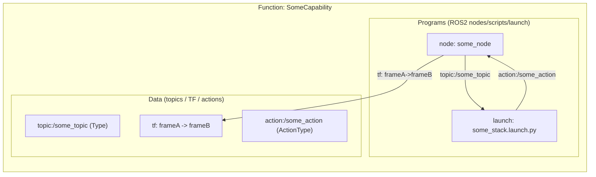
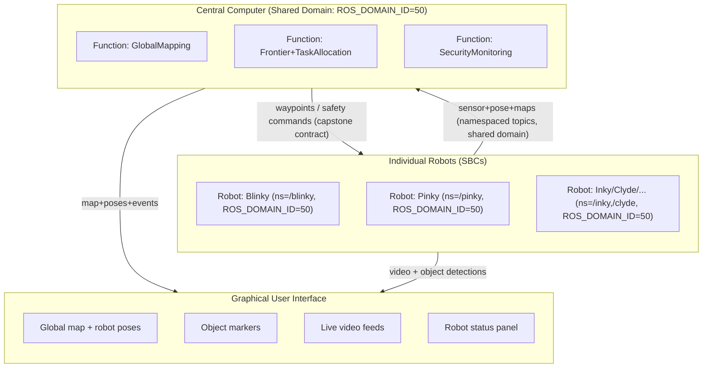
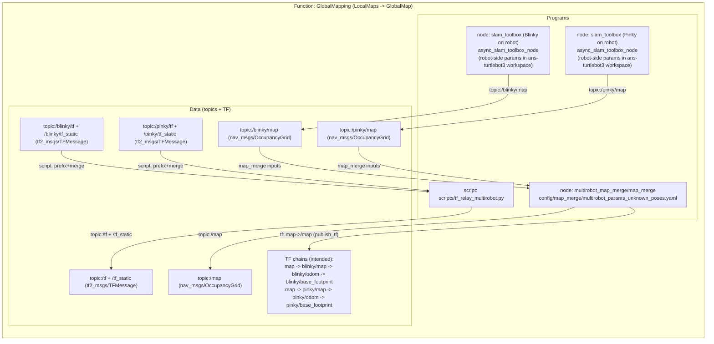
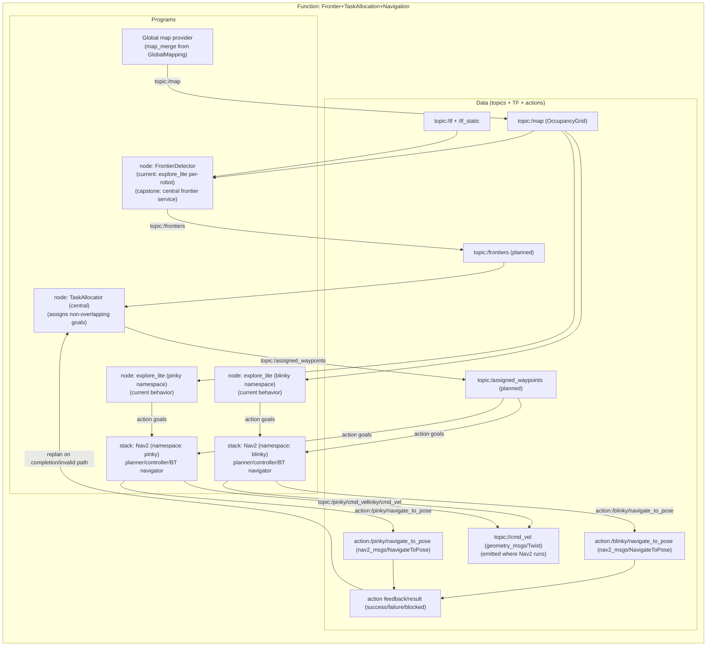
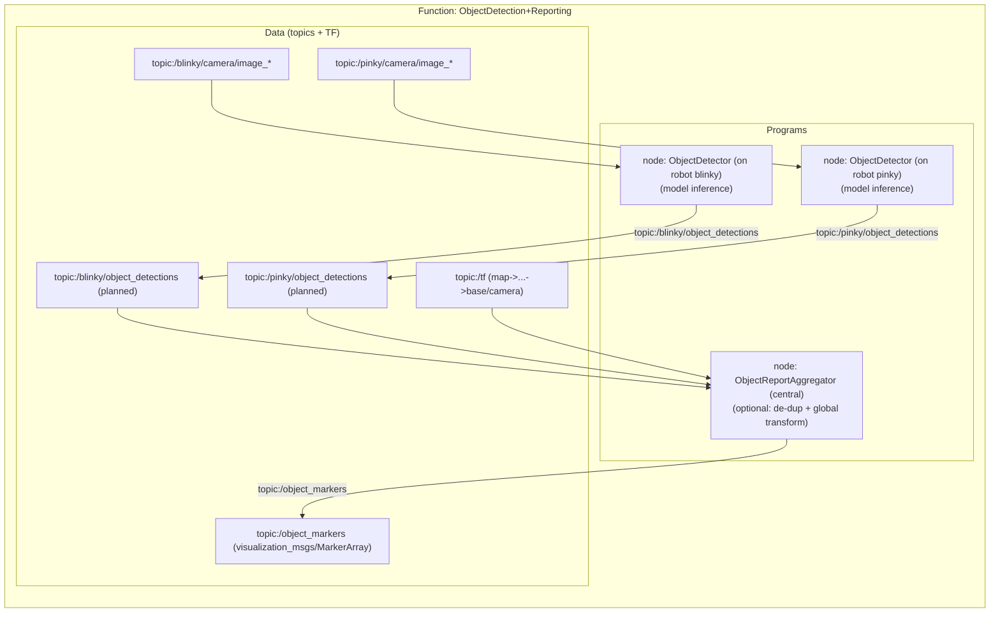
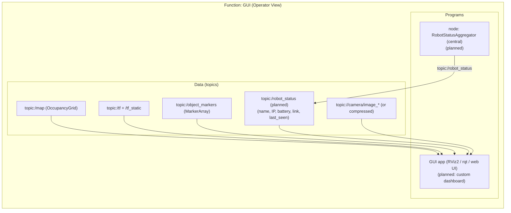
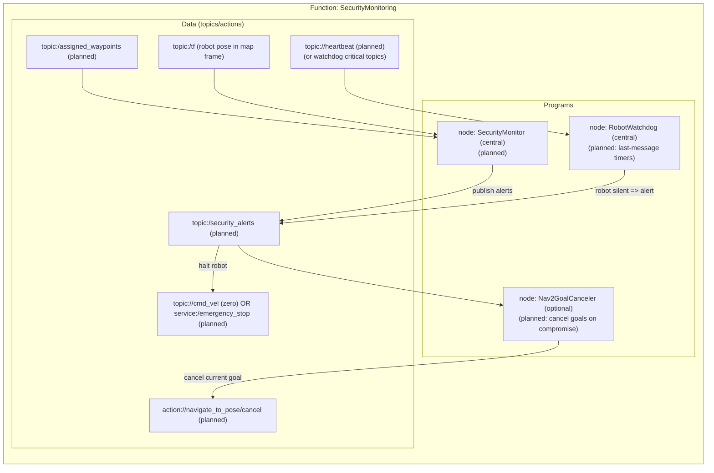

# Capstone architecture (nested “boxes in boxes” diagrams)

These diagrams are meant to answer, at a glance:

- **What** big functions exist (outer box)
- **Which ROS2 programs/nodes** implement them (box inside)
- **Which ROS2 data flows** (topics/TF/actions) connect them (innermost box)

If you keep the diagrams “small and many” (instead of “one giant”), they stay readable and are easy to update as your capstone evolves.

---

## Legend + reusable template

- **Outer box** = Capstone function (capability)
- **Middle box** = ROS2 programs (nodes, launch files, scripts)
- **Inner box** = Data contracts (topics, TF frames, actions, services)
- **Arrow direction** = producer → consumer
- **Arrow label** = the specific contract (e.g., `topic:/map`, `tf:map->odom`, `action:NavigateToPose`)

---

## System context (Central ↔ Robots ↔ GUI)

---

## Function: GlobalMapping (multi-robot SLAM + map merge) — matches current workspace

This function already exists in your central workspace. Robots (Blinky, Pinky, Inky, etc.) now run **namespaced** Nav2 + SLAM stacks on a shared domain (e.g. `ROS_DOMAIN_ID=50`), and the central computer consumes their maps and TF directly without domain bridges.

- **TF stitching**: `scripts/tf_relay_multirobot.py` (merges `/blinky/tf`, `/pinky/tf`, `/inky/tf` into `/tf` with prefixes)
- **Per-robot SLAM**: `slam_toolbox` instances on each robot, publishing `/blinky/map`, `/pinky/map`, etc.
- **Map merge**: `multirobot_map_merge/map_merge` using `config/map_merge/multirobot_params_unknown_poses.yaml` (for unknown initial poses on the central computer)

### Note on laser scan normalization

- Your bridged topic list currently includes **`/blinky/scan_normalized`** and **`/pinky/scan_normalized`** (see `config/domain_bridge/*_bridge.yaml`), and your SLAM params consume `scan_topic: /<robot>/scan_normalized`.
- The `multirobot_slam.launch.py` file also starts a central normalizer that expects `/<robot>/scan`. If you keep using robot-side normalization (common), that central normalizer is effectively optional. If you want central-side normalization, ensure `/<robot>/scan` is bridged into domain 50.

---

## Function: Frontier detection + waypoint assignment + navigation (capstone contract)

Your current workspace includes per-robot **Nav2** and per-robot **Explore Lite** in the aggregation domain:

- Launch: `src/turtlebot3/turtlebot3_navigation2/launch/multirobot_nav2_explore.launch.py`
- Starter: `scripts/start_multirobot_nav2_explore.sh`

For the capstone requirement (“optimized waypoints”, “minimize overlap”), you typically add a **central TaskAllocator** that assigns frontiers/waypoints per robot (instead of each robot greedily exploring on its own).

---

## Function: Object detection + reporting (capstone contract)

---

## Function: GUI (global map + markers + status + video)

---

## Function: Security monitoring (deviation + silence watchdog + quarantine)

